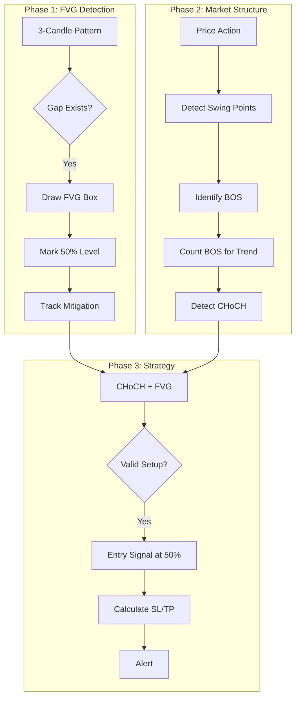

# Craig Percoco Strategy - PineScript Indicators Plan

Build the strategy concepts from the video as PineScript indicators using a phased approach.

---

## Phase 1: Fair Value Gap (FVG) Indicator

The foundation - detect imbalances in price.

**Logic:**

- Bullish FVG: `high[2] < low[0]` (gap up)
- Bearish FVG: `low[2] > high[0]` (gap down)
- Draw box from gap zone with 50% midpoint line
- Track if FVG gets filled (mitigated)

**Features:**

- Show bullish FVGs (green boxes)
- Show bearish FVGs (red boxes)
- 50% "Consequential Encroachment" line
- Option to hide mitigated FVGs
- Higher timeframe FVG overlay (for take-profit zones)

**File:** [`strategies/fvg_indicator_v1.pine`](strategies/fvg_indicator_v1.pine)

---

## Phase 2: Market Structure Indicator (BOS + CHoCH)

Detect swing points, breaks of structure, and trend character changes.

**Logic:**

- Detect swing highs/lows using pivot logic
- BOS: Price closes beyond previous swing point in trend direction
- CHoCH: Price fails to make new extreme AND breaks opposite direction

**Features:**

- Mark swing highs (HH, LH) and swing lows (LL, HL)
- Label BOS events with lines
- Label CHoCH events (trend reversal signals)
- Track trend state (uptrend/downtrend/ranging)
- Count BOS to confirm trend (need 2+)

**File:** [`strategies/market_structure_v1.pine`](strategies/market_structure_v1.pine)

---

## Phase 3: Combined Strategy with Alerts

Merge FVG + Market Structure into actionable trade signals.

**Entry conditions:**

1. Confirmed trend (2+ BOS)
2. CHoCH detected (potential reversal)
3. FVG forms with the CHoCH candle
4. Entry at 50% of FVG

**Trade management:**

- Stop loss: Below swing point or FVG-producing candle low
- Initial target: 4x risk
- Move to break-even after first BOS in new direction
- Optional: Fibonacci 61.8% as take-profit zone

**Features:**

- Entry signals (long/short arrows)
- Auto-calculate stop loss and take profit levels
- Visual entry zone (FVG 50% level)
- Alerts for new setups
- Backtest as strategy (not just indicator)

**File:** [`strategies/choch_fvg_strategy_v1.pine`](strategies/choch_fvg_strategy_v1.pine)

---

## Indicator Flow

---

## Summary Update

Before coding, update [`transcript_summary.md`](transcript_summary.md)(projects/from_0.1k_to_1k/Videos/Craig Percoco/The Perfect Beginner DAY TRADING Strategy (Step-by-Step)/transcript_summary.md) with:

- FVG invalidation rule (immediate fill = no trade)
- Displacement candle definition
- Specific Fibonacci levels (61.8 key)
- Higher timeframe usage (15m for targets)
