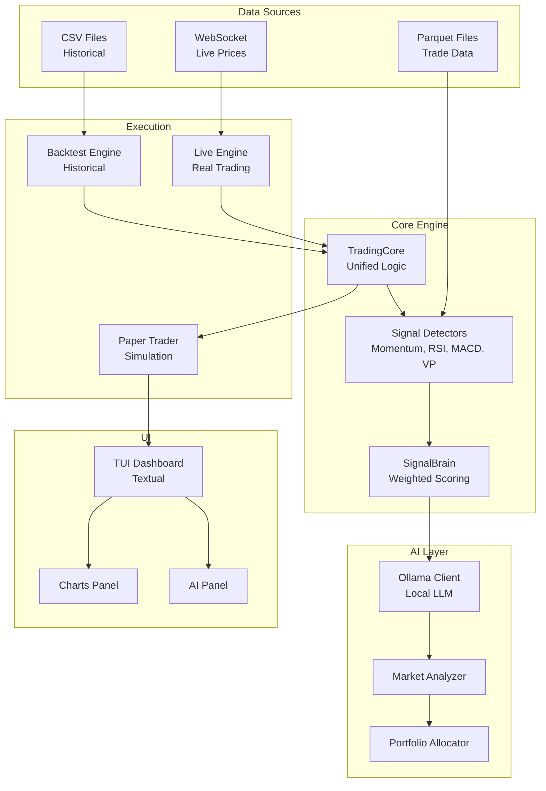

# Trading Bot

AI-powered crypto trading bot for Hyperliquid with paper trading simulation and backtesting.

## Quick Start

**No API keys needed for paper trading!**

```bash
# 1. Setup (first time only)
python3 -m venv venv
source venv/bin/activate
pip install -r requirements.txt

# 2. Start Ollama for AI mode (optional)
ollama serve
ollama pull mistral

# 3. Run the dashboard
./dev.sh default              # Start with $10000
./dev.sh my_strategy 5000     # Custom session with $5000
```

## Prerequisites

- Python 3.11+
- Ollama (for AI mode) - `brew install ollama` or https://ollama.ai

## Files

| File | Purpose |
|------|---------|
| `dev.sh` | Development mode with hot reload (CSS + Python auto-restart) |
| `start.sh` | Start paper trading simulator |
| `stop.sh` | Stop the trading bot |
| `run_backtest.py` | Run backtests on historical data |
| `pyproject.toml` | Python project config (dependencies, Ruff, MyPy settings) |
| `requirements.txt` | Python dependencies |
| `test_ai.py` | AI integration tests |
| `test_ui.py` | UI component tests |

## Commands

```bash
# Development mode with hot reload
./dev.sh <session_name> [balance]
./dev.sh my_strategy           # Load/create session with $10000
./dev.sh aggressive 5000       # Load/create session with $5000

# Historical replay mode
./dev.sh --historical data/historical/BTCUSD_1m_....csv
./dev.sh --historical data/historical/BTCUSD_1m_....csv --speed 0.1

# List sessions
./dev.sh --list

# Run backtests
python run_backtest.py --help

# Run tests
python -m pytest tests/
```

## Architecture



## Folders

| Folder | Purpose |
|--------|---------|
| `bot/` | Main Python package with trading logic |
| `data/` | Historical data, sessions, and feedback |
| `docs/` | Documentation and architecture decisions |
| `tests/` | Unit and integration tests |
