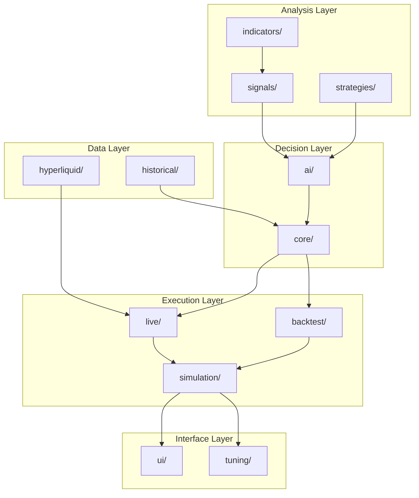
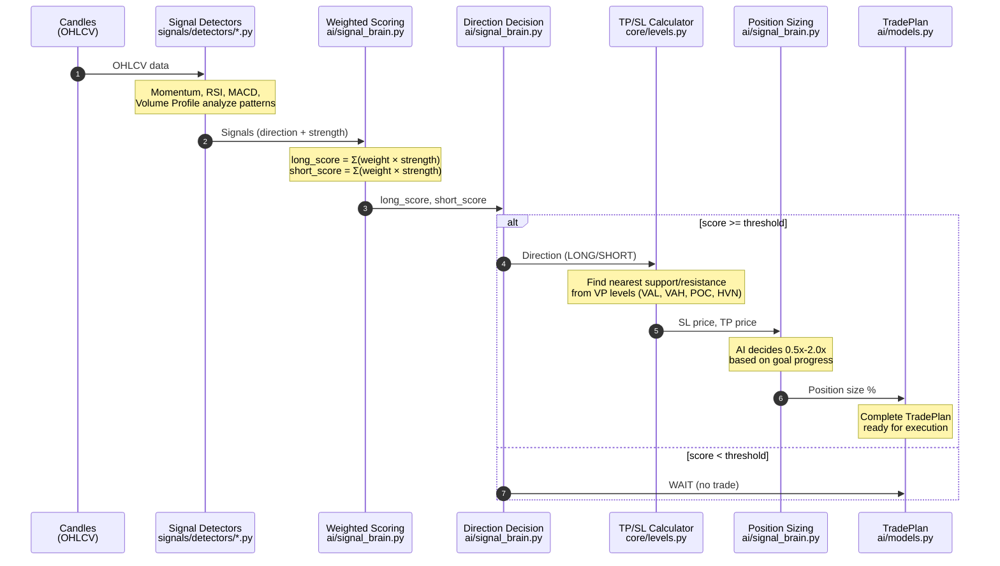

# Bot

Main Python package containing all trading bot logic.

## Folders

| Folder | Purpose |
|--------|---------|
| `ai/` | AI-powered analysis, decision making, and position sizing |
| `backtest/` | Backtesting engine and position management |
| `core/` | Core trading logic, models, and unified trading engine |
| `historical/` | Historical data fetching and storage |
| `hyperliquid/` | Hyperliquid exchange API client and WebSocket |
| `indicators/` | Technical indicators (ATR, MACD, RSI, Volume Profile) |
| `live/` | Live trading engine using real-time data |
| `signals/` | Signal detection and aggregation system |
| `simulation/` | Paper trading simulator and state management |
| `strategies/` | Trading strategy definitions and configurations |
| `tuning/` | Parameter tuning and performance analysis |
| `ui/` | Textual TUI dashboard and components |

## Architecture

## Trading Flow

The trading system follows a deterministic signal-to-trade pipeline:

**Key Insight:** The AI never decides direction. Direction is deterministic from weighted scoring. The AI only decides **how much** to risk on a trade that's already been decided.

## Running Modes

| Mode | Command | Behavior |
|------|---------|----------|
| Signals Only | (no --ai flag) | Steps 1-4, no AI sizing |
| AI Sizing | `--ai` | Steps 1-5 with AI position sizing |
| AI + Goals | `--ai --goal X --goal-days Y` | AI sizes based on goal progress |
| Portfolio | `--ai --portfolio --goal X` | Multi-asset allocation |
