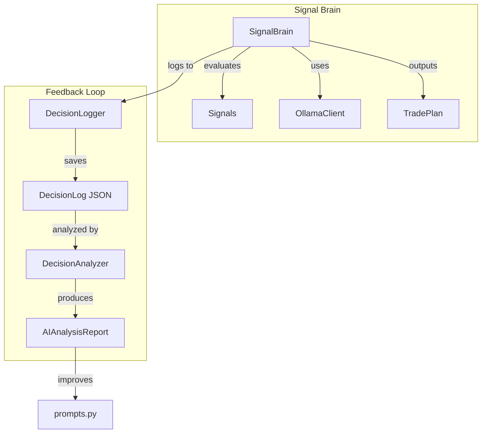

# AI Module

AI-powered trading analysis and decision-making components.

## Components

### Core Components

| File | Description |
|------|-------------|
| `signal_brain.py` | Main AI decision maker - evaluates signals and produces trade plans |
| `ollama_client.py` | Client for Ollama local LLM API |
| `prompts.py` | Prompt templates for AI evaluation |
| `models.py` | Data models (TradePlan, MarketContext, etc.) |

### Analysis & Feedback Loop

| File | Description |
|------|-------------|
| `decision_logger.py` | Logs every AI decision with full context for analysis |
| `decision_analyzer.py` | Analyzes logged decisions to identify improvement opportunities |

### Legacy Components

| File | Description |
|------|-------------|
| `analyzer.py` | Legacy MarketAnalyzer (older approach) |

## Architecture



## Decision Logging

When `--log-decisions` is enabled during backtesting:

1. **Every AI decision is logged** with:
   - Input signals and their weights
   - Market context (price, volatility, ATR)
   - AI decision (confirm/reject, confidence, reason)
   - Mode (AI or BYPASS)

2. **Trade outcomes are linked** after trades close:
   - WIN/LOSS/BREAKEVEN outcome
   - P&L and hold duration
   - Exit reason

3. **Post-backtest analysis** produces:
   - Confidence calibration (is AI over/under confident?)
   - Pattern analysis (which signal combos work?)
   - Rejection analysis (is AI rejecting good trades?)
   - Few-shot examples for prompt improvement

## Usage

### Basic Usage (with AI)

```python
from bot.ai import create_signal_brain

brain = create_signal_brain("momentum_based")
plan = await brain.evaluate_signals(signals, positions, context)
```

### With Decision Logging

```python
from bot.ai import create_signal_brain, AIDecisionLogger

logger = AIDecisionLogger(strategy_name="momentum_based")
brain = create_signal_brain("momentum_based", decision_logger=logger)

# After backtest...
log = logger.finalize()
log.save("data/logs/decisions.json")
```

### Analyzing Decisions

```python
from bot.ai import analyze_decision_log

report = analyze_decision_log("data/logs/decisions.json")
report.print_summary()

# Get prompt improvements
prompt_addition = report.to_prompt_injection()
few_shots = report.to_few_shot_examples()
```

## Backtest Modes

| Mode | Flag | Description |
|------|------|-------------|
| Signals-Only | (none) | Pure signal-based trading, no AI |
| AI Mode | `--ai` | AI determines position sizing (0.5x-2.0x) |
| AI + Goals | `--ai --goal X --goal-days Y` | AI sizes based on goal progress |
| Portfolio | `--ai --portfolio` | AI allocates across multiple assets |
| With Logging | `--ai --log-decisions` | AI mode with decision logging for analysis |

## Configuration

### Strategy Settings (affect AI behavior)

```python
Strategy(
    min_confidence=6,      # Minimum AI confidence to execute (1-10)
    signal_threshold=0.7,  # Minimum weighted score to consider
    signal_weights={...},  # Weight per signal type
)
```

### Prompt Customization

Edit `prompts.py` to customize:
- `TRADING_SYSTEM_PROMPT` - System role and rules
- `SIGNAL_EVALUATION_PROMPT` - Trade evaluation template
