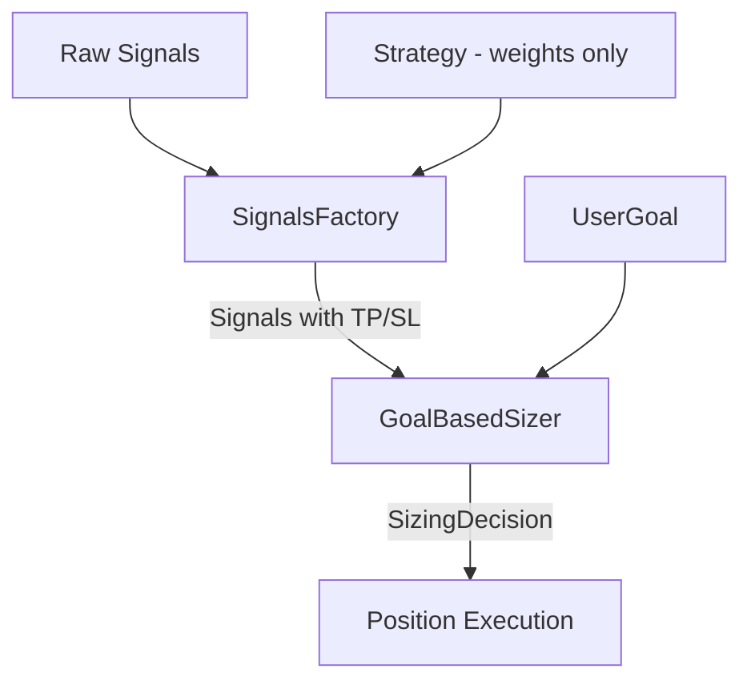

# AI Module

AI-powered trading analysis and decision-making components.

## Architecture


```mermaid
flowchart TD
    Signals[Raw Signals] --> Factory[SignalsFactory]
    Strategy[Strategy - weights only] --> Factory
    Factory -->|Signals with TP/SL| Sizer[GoalBasedSizer]
    Goal[UserGoal] --> Sizer
    Sizer -->|SizingDecision| Execution[Position Execution]
```

## Components

### Goal-Based Position Sizing

| File | Description |
|------|-------------|
| `goal_sizer.py` | AI position sizer based on user goals |
| `models.py` | UserGoal, RiskTolerance, SizingDecision models |
| `ollama_client.py` | Client for Ollama local LLM API |

### Portfolio Allocation

| File | Description |
|------|-------------|
| `portfolio_allocator.py` | Multi-asset AI allocation |

### Analysis & Feedback Loop

| File | Description |
|------|-------------|
| `decision_logger.py` | Logs every AI decision with full context for analysis |
| `decision_analyzer.py` | Analyzes logged decisions to identify improvement opportunities |

### Legacy Components

| File | Description |
|------|-------------|
| `analyzer.py` | Legacy MarketAnalyzer |
| `prompts.py` | Legacy prompt templates |

## Usage

### Standard Flow

```python
from bot.signals import SignalsFactory
from bot.ai import GoalBasedSizer, UserGoal, create_goal_sizer
from bot.strategies import get_strategy

# Setup
strategy = get_strategy("momentum_based")
factory = SignalsFactory(strategy)
goal = UserGoal.aggressive_growth(multiplier=2.0, days=30)
sizer = GoalBasedSizer(ollama_client, goal)

# Process signals (pure - no AI)
output = factory.process_signals(signals, market_context)

if output:
    # AI sizes position based on goal
    sizing = await sizer.size_position(output, account_context)

    if sizing.should_trade:
        # sizing.risk_percent - % of account to risk
        # sizing.position_size_pct - actual position size
        execute_trade(output.direction, sizing)
```

### Deterministic Fallback (No AI)

```python
# Use deterministic sizing when AI unavailable
sizing = sizer.size_position_deterministic(output, account_context)
```

### User Goals

```python
from bot.ai import UserGoal, RiskTolerance

# Conservative goal
goal = UserGoal.conservative(days=30)

# Aggressive growth
goal = UserGoal.aggressive_growth(multiplier=2.0, days=30)

# Custom goal
goal = UserGoal(
    description="Triple my account in 2 months",
    target_multiplier=3.0,
    timeframe_days=60,
    risk_tolerance=RiskTolerance.AGGRESSIVE,
)
```

## Decision Logging

When `--log-decisions` is enabled during backtesting:

1. **Every AI decision is logged** with:
   - Input signals and their weights
   - Market context (price, volatility, ATR)
   - AI decision (confirm/reject, confidence, reason)

2. **Trade outcomes are linked** after trades close

3. **Post-backtest analysis** produces insights

## Key Concepts

### Separation of Concerns

- **SignalsFactory** (bot.signals.factory): Pure signal processing, no AI
  - Filters signals by strategy weights
  - Calculates weighted scores
  - Checks threshold
  - Enriches signals with TP/SL

- **GoalBasedSizer**: AI position sizing
  - Receives enriched signals from factory
  - Considers user goal and account progress
  - Determines risk % and position size

### Strategies Are Pure Configuration

Strategies define only:
- Signal weights (which signals matter and how much)
- Thresholds (minimum score to trade)
- Risk config (ATR multipliers, max position size)

They do NOT contain prompts or AI logic.
