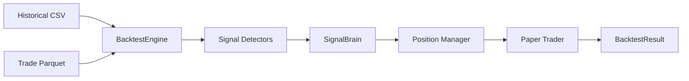
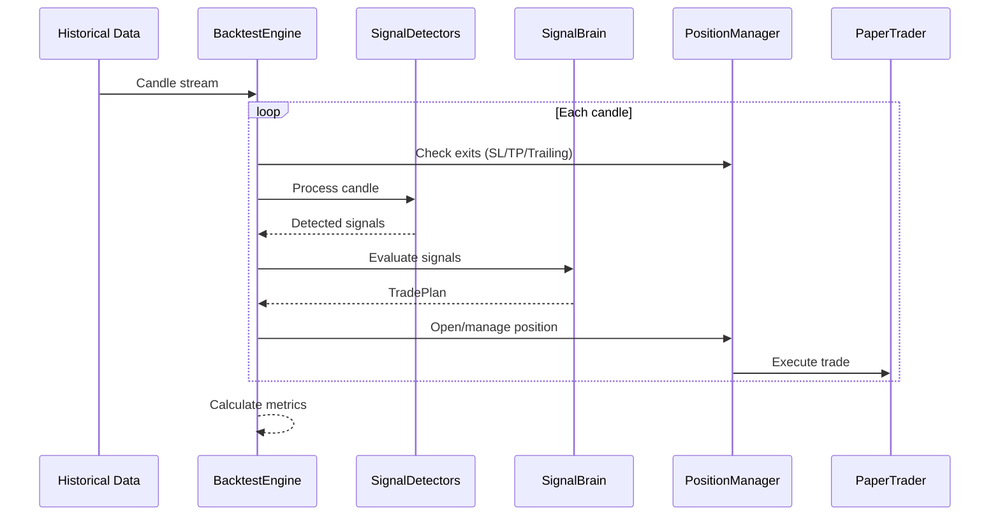

# Backtest

Backtesting engine for testing trading strategies on historical data.

## Files

| File | Purpose |
|------|---------|
| `__init__.py` | Package exports |
| `engine.py` | Main BacktestEngine orchestrating the 3-layer architecture |
| `models.py` | BacktestConfig, BacktestResult, EquityPoint, PrevDayVPLevels |
| `position_manager.py` | Position lifecycle management with trailing stops |
| `breakout_analyzer.py` | Analyzes signal accuracy against price breakouts |

## Commands

```bash
# Signals-only mode (fast, no AI required)
python run_backtest.py

# With AI position sizing (requires Ollama running)
python run_backtest.py --ai

# Specific strategy
python run_backtest.py --strategy momentum_based
python run_backtest.py --strategy rsi_based

# Custom data file
python run_backtest.py --data data/historical/BTCUSD_1m_....csv

# With AI decision logging for analysis
python run_backtest.py --ai --log-decisions
```

## Options

| Option | Short | Default | Description |
|--------|-------|---------|-------------|
| `--data` | `-d` | latest CSV | Path to historical data CSV |
| `--ai` | - | disabled | Enable AI position sizing (requires Ollama) |
| `--strategy` | `-s` | momentum_based | Trading strategy to use |
| `--balance` | `-b` | 10000 | Starting balance in USD |
| `--signals` | - | all | Signal detectors (momentum, rsi, macd, vp, pdvp) |
| `--log-decisions` | - | disabled | Log AI decisions for analysis |

## Architecture



## Flow


