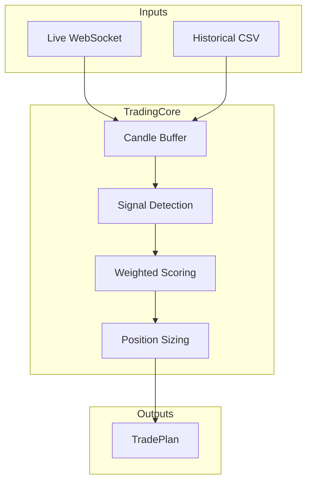

# Core

Core trading logic used by both backtest and live engines.

## Files

| File | Purpose |
|------|---------|
| `__init__.py` | Package exports |
| `trading_core.py` | Unified TradingCore - single source of truth for trading logic |
| `candle_aggregator.py` | Aggregates price ticks into OHLCV candles |
| `config.py` | TradingConfig and default configuration |
| `models.py` | Core data models (MarketPressure, etc.) |
| `levels.py` | StructureLevels and TP/SL calculation from Volume Profile |
| `analysis/` | Market analysis utilities |

## Architecture

The TradingCore ensures backtest results are predictive of live performance by using identical logic for both modes.
