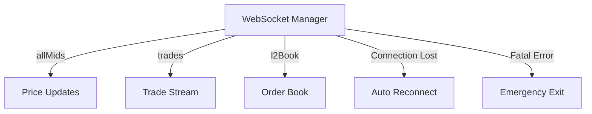

# Hyperliquid

Hyperliquid exchange API client and WebSocket manager.

## Files

| File | Purpose |
|------|---------|
| `__init__.py` | Package exports |
| `client.py` | HTTP API client for Hyperliquid |
| `public_data.py` | Public data endpoints (prices, orderbook) |
| `stream.py` | Data streaming utilities |
| `websocket_manager.py` | Robust WebSocket connection with auto-reconnect |
| `watch_prices.py` | Simple price watcher utility |
| `test_connection.py` | Connection testing script |
| `examples/` | Example scripts for API usage |

## Quick Start (Simulation Mode)

**No API keys needed!** For paper trading, just run the bot - it uses public WebSocket data.

```bash
# Test market data connection
python bot/hyperliquid/public_data.py
```

## API Endpoints

| Environment | REST API | WebSocket |
|-------------|----------|-----------|
| Mainnet | `https://api.hyperliquid.xyz` | `wss://api.hyperliquid.xyz/ws` |
| Testnet | `https://api.hyperliquid-testnet.xyz` | `wss://api.hyperliquid-testnet.xyz/ws` |

## Testnet Setup (Optional)

For testing real order execution with fake money:

1. Go to https://app.hyperliquid-testnet.xyz
2. Connect wallet and claim testnet funds from faucet
3. Create API wallet at https://app.hyperliquid-testnet.xyz/API
4. Create `.env` file:
   ```
   HYPERLIQUID_PRIVATE_KEY=your_api_wallet_private_key
   HYPERLIQUID_ENV=testnet
   ```

## Architecture



## Safety Features

- Auto-reconnect with exponential backoff
- Emergency position exit on disconnect
- Connection state monitoring
- Ping/pong health checks

## Troubleshooting

| Error | Solution |
|-------|----------|
| "Insufficient balance" | Claim from testnet faucet |
| "Invalid signature" | Check API wallet key (not main wallet) |
| "Rate limited" | Add delays between requests |
