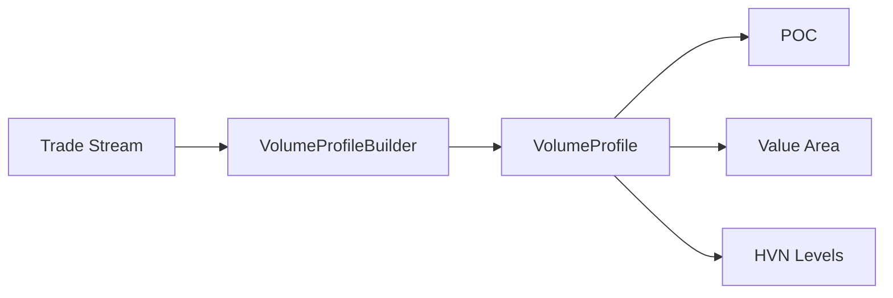

# Volume Profile

Volume Profile indicator for identifying key price levels.

## Files

| File | Purpose |
|------|---------|
| `__init__.py` | Package exports and utility functions |
| `builder.py` | VolumeProfileBuilder - aggregates trades into price levels |
| `indicator.py` | Volume Profile analysis and level detection |
| `models.py` | Trade, VolumeProfile, and level models |

## Key Concepts

| Level | Description |
|-------|-------------|
| POC | Point of Control - price with highest volume |
| VAH | Value Area High - upper bound of 70% volume |
| VAL | Value Area Low - lower bound of 70% volume |
| HVN | High Volume Nodes - local volume peaks |

## Architecture



## Usage

```python
from bot.indicators.volume_profile import (
    VolumeProfileBuilder,
    get_poc,
    get_value_area,
    get_hvn_levels,
)

# Build profile from trades
builder = VolumeProfileBuilder(tick_size=10.0)
for trade in trades:
    builder.add_trade(trade)

profile = builder.get_profile()
poc = get_poc(profile)
vah, val = get_value_area(profile)
hvn = get_hvn_levels(profile)
```
