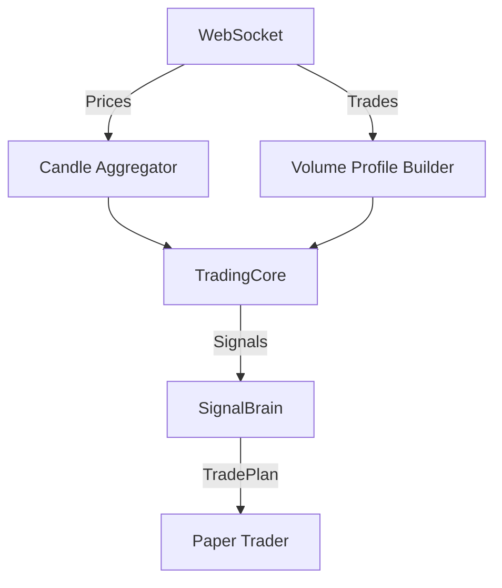

# Live

Live trading engine for real-time trading using WebSocket data.

## Files

| File | Purpose |
|------|---------|
| `__init__.py` | Package exports |
| `engine.py` | LiveEngine - real-time trading using unified TradingCore |

## Commands

```bash
# Signals-only mode (no AI)
python -m bot.live.engine --balance 10000

# AI position sizing with goal
python -m bot.live.engine --ai --goal 50000 --goal-days 30

# Portfolio mode (multi-asset allocation)
python -m bot.live.engine --ai --portfolio --goal 50000 --goal-days 30

# Custom coins and strategy
python -m bot.live.engine --coins BTC ETH SOL --strategy momentum_macd --ai
```

## Architecture



Uses the SAME TradingCore as BacktestEngine, ensuring backtest results predict live performance.
