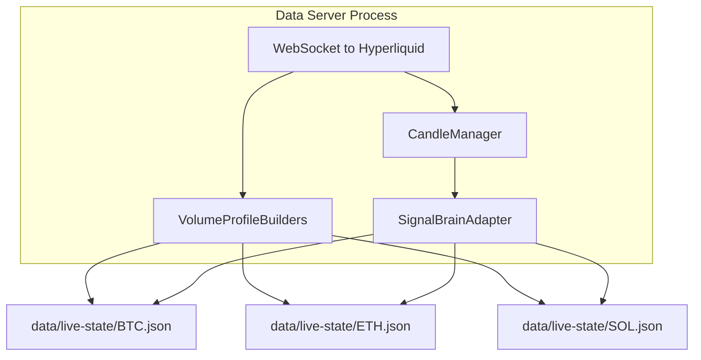

# Server

Background data server for multi-terminal dashboard architecture.

## Purpose

Handles WebSocket connection and data processing centrally, writing state files that UI terminals read.

## Files

| File | Purpose |
|------|---------|
| `__init__.py` | Package exports |
| `data_server.py` | DataServer class - WebSocket handling + state file writing |

## Architecture



## Commands

```bash
# Run the data server directly
python -m bot.server.data_server --strategy momentum_based

# Or via CLI
python -m bot.ui.cli --server --strategy momentum_based
```

## State File Format

Each coin has a JSON state file at `data/live-state/{coin}.json`:

```json
{
  "coin": "BTC",
  "timestamp": "2026-01-30T12:34:56",
  "price": 99450.0,
  "indicators": {
    "session_vp": {"poc": 99200, "vah": 99800, "val": 98500, "lvn": [98750]}
  },
  "signals": {
    "active": [{"type": "momentum", "direction": "LONG", "strength": 0.85}],
    "combined": {"direction": "LONG", "score": 1.20, "threshold": 0.70}
  }
}
```
