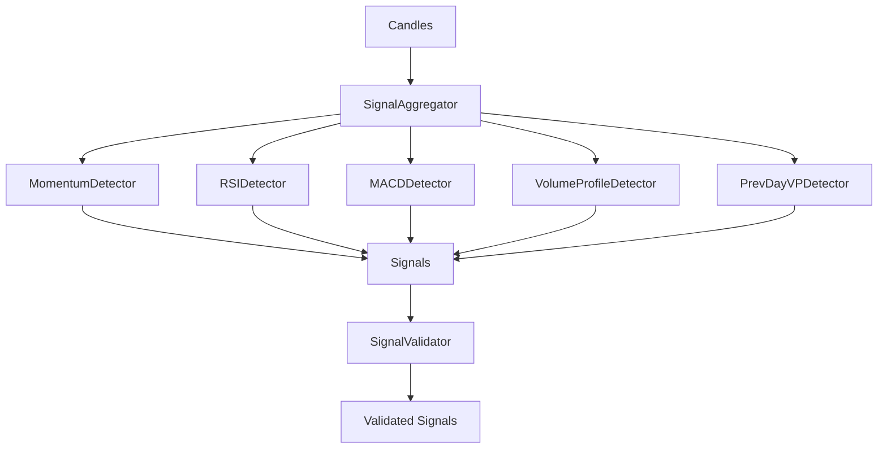

# Signals

Signal detection and aggregation system for identifying trading opportunities.

## Files

| File | Purpose |
|------|---------|
| `__init__.py` | Package exports |
| `aggregator.py` | SignalAggregator - combines multiple detectors |
| `base.py` | Base Signal class and SignalDetector interface |
| `validator.py` | SignalValidator - filters historically inaccurate signals |
| `detectors/` | Individual signal detector implementations |

## Architecture

## Signal Types

| Detector | Pattern |
|----------|---------|
| Momentum | EMA crossovers |
| RSI | Oversold/overbought + divergences |
| MACD | Histogram momentum |
| Volume Profile | VAH/VAL breakouts, POC tests |
| Prev Day VP | Previous day's level reactions |
