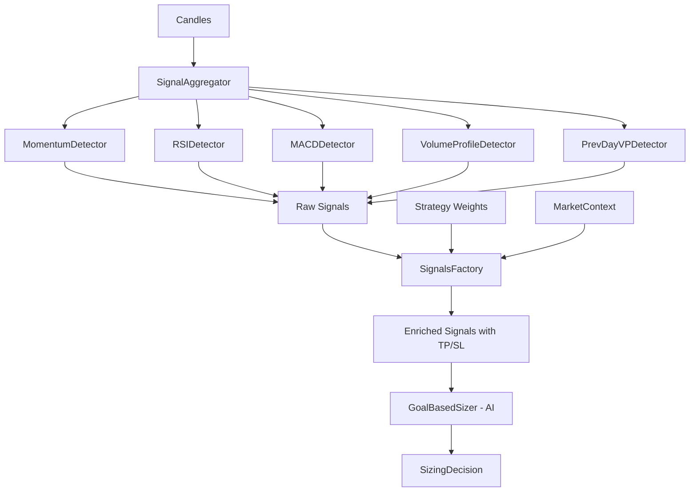

# Signals

Signal detection, processing, and enrichment system for identifying trading opportunities.

## Files

| File | Purpose |
|------|---------|
| `__init__.py` | Package exports |
| `base.py` | Signal class with position info (entry, SL, TP) and SignalDetector interface |
| `factory.py` | SignalsFactory - filters, weights, and enriches signals (no AI) |
| `aggregator.py` | SignalAggregator - combines multiple detectors |
| `validator.py` | SignalValidator - filters historically inaccurate signals |
| `detectors/` | Individual signal detector implementations |

## Architecture


```mermaid
flowchart TD
    CANDLES[Candles] --> AGG[SignalAggregator]

    AGG --> MOM[MomentumDetector]
    AGG --> RSI[RSIDetector]
    AGG --> MACD[MACDDetector]
    AGG --> VP[VolumeProfileDetector]
    AGG --> PDVP[PrevDayVPDetector]

    MOM --> SIGNALS[Raw Signals]
    RSI --> SIGNALS
    MACD --> SIGNALS
    VP --> SIGNALS
    PDVP --> SIGNALS

    SIGNALS --> FACTORY[SignalsFactory]
    STRATEGY[Strategy Weights] --> FACTORY
    MARKET[MarketContext] --> FACTORY
    FACTORY --> ENRICHED[Enriched Signals with TP/SL]

    ENRICHED --> SIZER[GoalBasedSizer - AI]
    SIZER --> SIZING[SizingDecision]
```

## SignalsFactory

The SignalsFactory is a **pure** signal processor (no AI):

1. **Filters** signals by strategy's signal_weights
2. **Calculates** weighted scores for LONG/SHORT
3. **Checks** against signal_threshold
4. **Enriches** signals with entry_price, stop_loss, take_profit

```python
from bot.signals import SignalsFactory
from bot.strategies import get_strategy

strategy = get_strategy("momentum_based")
factory = SignalsFactory(strategy)

# Process raw signals
output = factory.process_signals(raw_signals, market_context)

if output:
    # output.direction - "LONG" or "SHORT"
    # output.signals - enriched with TP/SL
    # output.weighted_score - how strong the signal is
```

## Signal Model

Signals now carry position information:

```python
@dataclass
class Signal:
    coin: str
    signal_type: SignalType
    direction: Literal["LONG", "SHORT"]
    strength: float  # 0.0-1.0
    timestamp: datetime
    metadata: dict[str, Any]

    # Position info (populated by SignalsFactory)
    entry_price: float | None = None
    stop_loss: float | None = None
    take_profit: float | None = None
    atr: float | None = None
```

## Signal Types

| Detector | Pattern |
|----------|---------|
| Momentum | EMA crossovers |
| RSI | Oversold/overbought + divergences |
| MACD | Histogram momentum |
| Volume Profile | VAH/VAL breakouts, POC tests |
| Prev Day VP | Previous day's level reactions |
