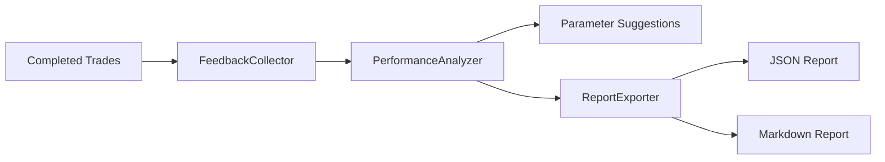

# Tuning

Parameter tuning and performance analysis for strategy optimization.

## Files

| File | Purpose |
|------|---------|
| `__init__.py` | Package exports |
| `analyzer.py` | PerformanceAnalyzer - analyzes trade outcomes for suggestions |
| `collector.py` | FeedbackCollector - records trade data for analysis |
| `exporter.py` | TuningReportExporter - exports reports in JSON and Markdown |

## Flow

## Reports

Reports are saved to `data/sessions/<session>/reports/` and include:
- Win rate by market condition
- Optimal parameter suggestions
- Trade distribution analysis
