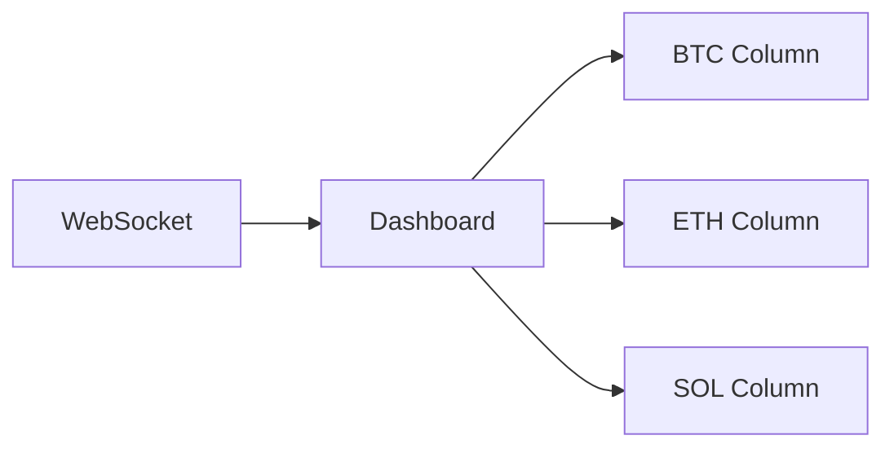
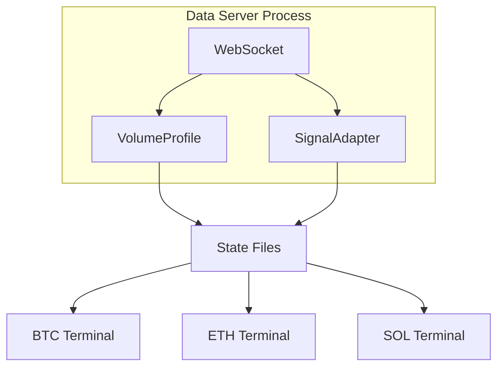

# UI

Textual TUI dashboard for indicator validation and signal observation.

## Files

| File | Purpose |
|------|---------|
| `__init__.py` | Package exports |
| `dashboard.py` | TradingDashboard - main Textual App (v2) |
| `cli.py` | Command-line interface with interactive mode |
| `components/` | Reusable UI components |
| `styles/` | CSS theme files |

## Commands

### Single-Window Mode (3 columns)

```bash
# Interactive mode (prompts for options)
python -m bot.ui.cli

# Live mode (WebSocket connection)
python -m bot.ui.cli --live
python -m bot.ui.cli --live --strategy momentum_based

# Historical mode (data replay)
python -m bot.ui.cli --historical data/historical/BTC_20260126
python -m bot.ui.cli --historical data/historical/BTC_20260126 --speed 0.2

# Specify strategy and coins
python -m bot.ui.cli --live --strategy rsi_based --coins BTC ETH
```

### Multi-Terminal Mode (1 window per market)

For flexible screen arrangement, run each market in its own terminal:

```bash
# 1. Start the data server (once, in a background terminal)
python -m bot.ui.cli --server --strategy momentum_based

# 2. Open individual market terminals (one per market)
# Terminal 1:
python -m bot.ui.cli --coin BTC

# Terminal 2:
python -m bot.ui.cli --coin ETH

# Terminal 3:
python -m bot.ui.cli --coin SOL
```

Arrange the terminal windows however you want on your screen.

### List Options

```bash
python -m bot.ui.cli --list-strategies
python -m bot.ui.cli --list-historical
```

## Architecture

### Single-Window Mode



### Multi-Terminal Mode



## Keybindings

| Key | Action | Description |
|-----|--------|-------------|
| `q` | Quit | Exit dashboard |
| `Space` | Pause | Pause/resume data processing |
| `r` | Reset | Reset all state (not in client mode) |
