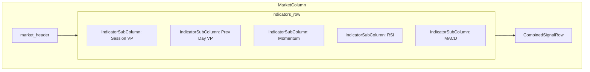

# Components

Reusable Textual UI components for the trading dashboard v2.

## Files

| File | Purpose |
|------|---------|
| `__init__.py` | Package exports |
| `indicator_subcolumn.py` | IndicatorSubColumn - displays values and signal for one indicator |
| `combined_signal_row.py` | CombinedSignalRow - weighted signal total + scrollable log |
| `market_column.py` | MarketColumn - container for one market (BTC/ETH/SOL) |
| `signal_adapter.py` | SignalBrainAdapter - connects signals to UI display |
| `strategy_panel.py` | StrategyPanel - shows strategy weights as histogram, allows switching |

## Architecture

## Component Details

### MarketColumn

Container for a single market. Arranges indicator sub-columns horizontally
and shows combined signal at bottom.

Features:
- Reactive `has_data` property - shows "Missing Data" warning when false
- Helper methods to get sub-components

### IndicatorSubColumn

Displays one indicator's values and individual signal. Supports:
- session_vp: POC, VAH, VAL, LVN
- prev_day_vp: Previous day's VP levels
- momentum: Price change percentages
- rsi: RSI value and OB/OS state
- macd: MACD line, signal, histogram

### CombinedSignalRow

Shows the weighted combination of all signals:
- Direction (LONG/SHORT/WAIT)
- Combined score with checkmark if actionable
- Individual signal contributions
- Scrollable log history

### SignalBrainAdapter

Bridges signal detectors to UI display:
- Debounces detector calls
- Caches signals per coin
- Calculates weighted scores using strategy weights

### StrategyPanel

Displays current strategy configuration below the title bar:
- Strategy name (press `s` to cycle through available strategies)
- Signal threshold value
- Visual weight histogram showing each indicator's weight (0.0-1.0)

Weight bars use filled blocks (█) proportional to the weight, making it easy
to see at a glance which indicators the strategy prioritizes.
