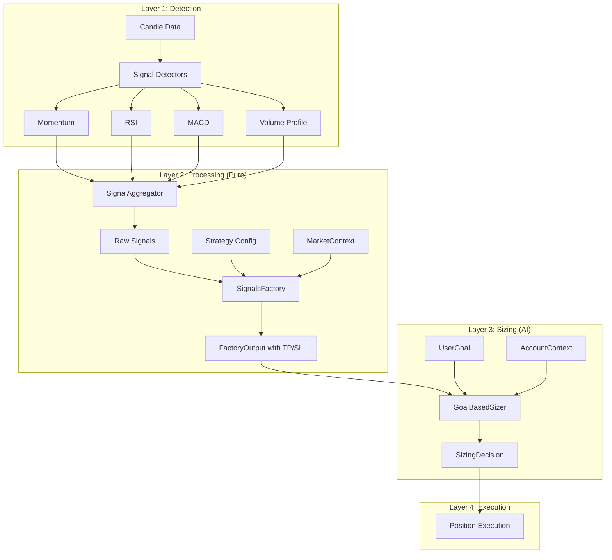

# Signals Architecture

This document describes the refactored signals and AI architecture for clean separation of concerns.

## Overview

The architecture separates three distinct responsibilities:

1. **SignalsFactory** - Pure signal processing (no AI)
2. **Strategy** - Configuration only (weights, thresholds, risk)
3. **GoalBasedSizer** - AI position sizing based on user goals



## Component Responsibilities

### SignalsFactory (bot/signals/factory.py)

Pure signal processor with no AI involvement:

| Method | Purpose |
|--------|---------|
| `process_signals()` | Filter, weight, threshold check, enrich with TP/SL |
| `_filter_signals()` | Filter by strategy's signal_weights |
| `_calculate_weighted_scores()` | Sum weighted contributions per direction |
| `_meets_threshold()` | Check if score exceeds threshold |
| `_enrich_signals()` | Add entry_price, stop_loss, take_profit based on ATR |

Output: `FactoryOutput` with direction, enriched signals, and score.

### Strategy (bot/strategies/base.py)

Pure configuration - no prompts or AI logic:

```python
@dataclass
class Strategy:
    name: str
    strategy_type: StrategyType
    risk: RiskConfig  # ATR multipliers, position limits
    signal_weights: dict[SignalType, float]  # Which signals and their importance
    signal_threshold: float  # Minimum score to trade
    min_signal_strength: float  # Noise filter
    min_confidence: int  # Confidence threshold
```

### GoalBasedSizer (bot/ai/goal_sizer.py)

The ONLY AI component for trading decisions:

| Method | Purpose |
|--------|---------|
| `size_position()` | AI determines risk % based on goal progress |
| `size_position_deterministic()` | Fallback without AI |

Input: FactoryOutput (signals with TP/SL), AccountContext, UserGoal
Output: SizingDecision (risk_percent, position_size_pct, reasoning)

### UserGoal (bot/ai/models.py)

User's trading objective:

```python
@dataclass
class UserGoal:
    description: str  # "Double my account in 30 days"
    target_multiplier: float  # 2.0
    timeframe_days: int  # 30
    risk_tolerance: RiskTolerance  # conservative/moderate/aggressive
```

## Data Flow

### Signal Model

```python
@dataclass
class Signal:
    # Identity
    coin: str
    signal_type: SignalType
    direction: Literal["LONG", "SHORT"]
    strength: float  # 0.0-1.0
    timestamp: datetime
    metadata: dict[str, Any]

    # Position info (populated by SignalsFactory)
    entry_price: float | None
    stop_loss: float | None
    take_profit: float | None
    atr: float | None
```

### FactoryOutput

```python
@dataclass
class FactoryOutput:
    direction: Literal["LONG", "SHORT"]
    signals: list[Signal]  # Enriched with TP/SL
    weighted_score: float
    threshold: float
```

### SizingDecision

```python
@dataclass
class SizingDecision:
    risk_percent: float  # % of account to risk
    position_size_pct: float  # Actual position size
    reasoning: str
```

## Usage Example

```python
from bot.signals import SignalsFactory, SignalAggregator
from bot.ai import GoalBasedSizer, UserGoal
from bot.strategies import get_strategy

# Setup
strategy = get_strategy("momentum_based")
factory = SignalsFactory(strategy)
goal = UserGoal.aggressive_growth(multiplier=2.0, days=30)
sizer = GoalBasedSizer(ollama_client, goal)

# On each candle...
raw_signals = aggregator.process_candle(coin, candles)

# Pure signal processing
output = factory.process_signals(raw_signals, market_context)

if output:
    # AI position sizing
    sizing = await sizer.size_position(output, account_context)

    if sizing.should_trade:
        execute_trade(
            direction=output.direction,
            entry=output.signals[0].entry_price,
            stop_loss=output.signals[0].stop_loss,
            take_profit=output.signals[0].take_profit,
            position_size=sizing.position_size_pct,
        )
```

## Benefits

1. **Testability**: SignalsFactory is pure - easy to unit test without AI
2. **Flexibility**: Can swap AI sizers or use deterministic fallback
3. **Clarity**: Clear separation of concerns
4. **Goal-focused**: AI makes decisions based on user objectives, not trading style
