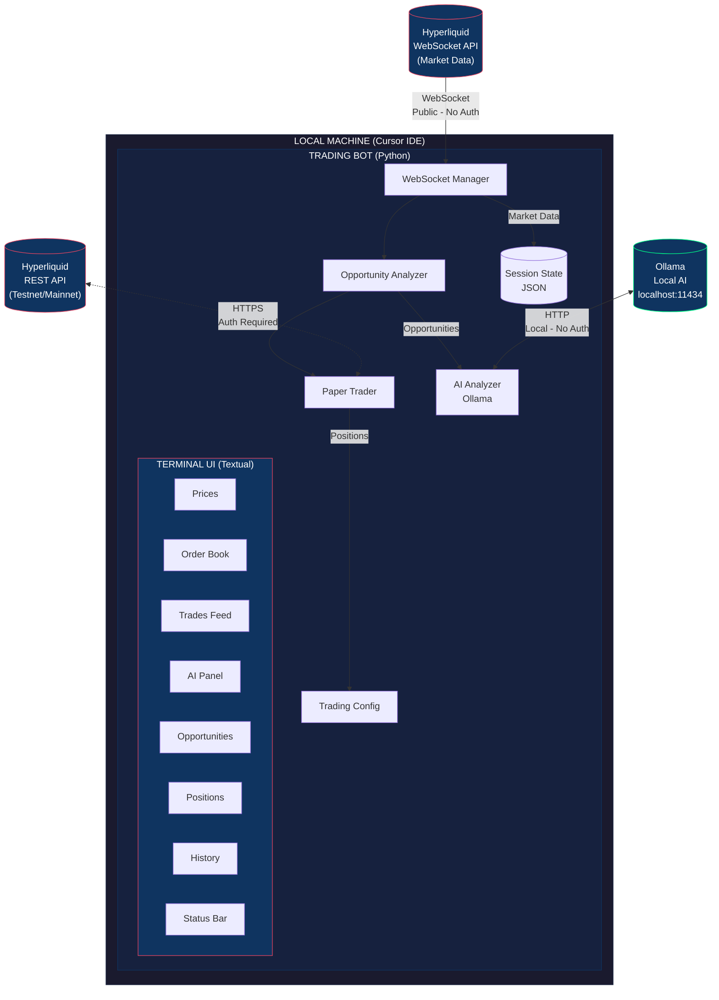
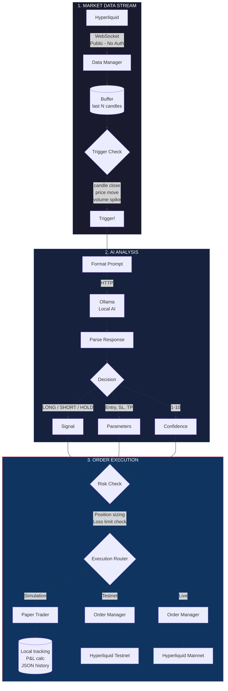

# System Architecture - Crypto AI Trading Bot

> **Version:** 1.3  
> **Last Updated:** January 18, 2026  
> **Status:** Draft

---

## 1. Overview

### 1.1 Purpose
A locally-run AI-powered trading bot that connects to Hyperliquid exchange for crypto futures scalping, using local AI (Ollama) for market analysis.

### 1.2 Key Design Principles
- **Local-first**: Runs entirely on user's machine (AI via Ollama, no cloud dependency)
- **Event-driven**: Reacts to market data streams in real-time
- **AI-augmented**: Local LLM analyzes market data and generates trading signals
- **Risk-managed**: Hard limits prevent catastrophic losses

### 1.3 Target User
- Scalp trader on 1-minute timeframe
- Small account (fee-sensitive)
- Based in Israel
- Using Cursor IDE for development

---

## 2. System Architecture

### 2.1 High-Level Diagram



### 2.2 Operating Modes

The bot supports three operating modes, allowing progression from safe testing to live trading:

| Mode | Market Data | Order Execution | Funds at Risk | Use Case |
|------|-------------|-----------------|---------------|----------|
| **Simulation** | Live from Hyperliquid | Local (simulated) | None | Strategy development, unlimited testing |
| **Testnet** | Live from testnet | Real orders on testnet | None (mock USDC) | API integration testing, order flow testing |
| **Live** | Live from mainnet | Real orders on mainnet | Real funds | Production trading |

**Mode Selection:**
```python
# config/settings.py
TRADING_MODE = "simulation"  # "simulation" | "testnet" | "live"
```

**Key Insight:** Simulation mode only requires public market data (no API keys needed). This enables unlimited paper trading with full control over starting balance and resets.

### 2.3 Data Flow



---

## 3. Component Specifications

### 3.1 Data Manager (WebSocket Manager)

**Responsibility:** Maintain robust WebSocket connection to exchange for real-time market data.

**Location:** `bot/hyperliquid/websocket_manager.py`

| Capability | Details |
|------------|---------|
| WebSocket connection | Persistent connection to Hyperliquid with auto-reconnect |
| Reconnection | Exponential backoff (1s → 30s max), up to 50 attempts |
| Heartbeat monitoring | Ping/pong every 20s, stale connection detection |
| Multi-subscription | Prices, trades, orderbook subscriptions |
| State tracking | DISCONNECTED, CONNECTING, CONNECTED, RECONNECTING, FATAL_ERROR |

**Interfaces:**
- Input: WebSocket messages from Hyperliquid
- Output: Parsed market data to dashboard via async callbacks

**Key Features:**
```python
# bot/hyperliquid/websocket_manager.py
class WebSocketManager:
    def __init__(
        self,
        config: WebSocketConfig,
        on_message: Callable[[dict], Awaitable[None]],
        on_connect: Callable[[], Awaitable[None]],
        on_disconnect: Callable[[str], Awaitable[None]],  # CRITICAL for safety
    ):
        ...
    
    async def start(self) -> None
    async def stop(self) -> None
    def add_subscription(self, subscription: dict) -> None
    def get_status_string(self) -> str
```

**Safety Features:**
- `on_disconnect` callback fires immediately on connection loss
- Allows trading system to exit positions before reconnection
- Detailed logging for debugging connection issues

### 3.2 AI Analyzer

**Responsibility:** Analyze market data using local AI and generate trading signals.

**Location:** `bot/ai/`

| Capability | Details |
|------------|---------|
| Local AI inference | Uses Ollama for local LLM inference (no cloud dependency) |
| Prompt engineering | Structured prompts for market analysis (`prompts.py`) |
| Response parsing | Sentiment, confidence, and signal extraction (`models.py`) |
| Async operation | Non-blocking AI calls via `httpx` |

**Interfaces:**
- Input: Market data (prices, momentum, orderbook, recent trades)
- Output: `AnalysisResult` with sentiment, confidence (1-10), signal, and reasoning

**Key Classes:**
```python
# bot/ai/analyzer.py
class MarketAnalyzer:
    async def analyze_market(coin, prices, momentum, orderbook, recent_trades) -> AnalysisResult
    async def quick_sentiment(prices, bid_ratio, buys, sells) -> Sentiment
    async def should_enter(coin, direction, price, momentum, bid_ratio) -> tuple[bool, int, str]

# bot/ai/models.py
class AnalysisResult:
    coin: str
    sentiment: Sentiment  # BULLISH, BEARISH, NEUTRAL
    confidence: int       # 1-10
    signal: Signal        # LONG, SHORT, HOLD
    reason: str
```

**AI Backend:**
| Backend | Use Case | Cost | Latency |
|---------|----------|------|---------|
| Ollama (local) | Default, privacy-focused | Free | ~1-3s (depends on hardware) |
| Claude API | Optional, higher quality | $$ | ~1-2s |

### 3.3 Order Manager

**Responsibility:** Execute trades, manage positions, track orders.

| Capability | Details |
|------------|---------|
| Order types | Market, Limit, Stop-Market |
| Position tracking | Current positions, average entry, P&L |
| Order lifecycle | Create, monitor, cancel, fill detection |
| Maker preference | Use limit orders for fee rebates |

**Interfaces:**
- Input: TradingDecision from AI Analyzer
- Output: Order requests to Hyperliquid REST API

### 3.4 Risk Manager

**Responsibility:** Enforce risk limits, prevent catastrophic losses.

| Rule | Default | Configurable |
|------|---------|--------------|
| Max position size | 0.1 BTC | Yes |
| Risk per trade | 1% of account | Yes |
| Max daily loss | $100 | Yes |
| Max open positions | 2 | Yes |
| Min confidence threshold | 70% | Yes |

**Kill Switches:**
- Daily loss limit hit → Stop all trading
- Drawdown threshold → Reduce position sizes
- API errors → Pause and alert

### 3.5 Paper Trading Simulator

**Responsibility:** Simulate order execution locally for strategy testing without real funds.

**Location:** `bot/simulation/paper_trader.py`

| Capability | Details |
|------------|---------|
| Position tracking | Simulated long/short positions with entry prices |
| P&L calculation | Real-time unrealized P&L based on live market prices |
| Balance management | Configurable starting balance, track equity curve |
| Trade history | Log all simulated trades (in-memory + JSON persistence) |
| Fee simulation | Apply Hyperliquid maker/taker fees (-0.02% / +0.025%) |
| Reset functionality | Clear all positions and reset to starting balance |
| State persistence | Load/save state via `SessionStateManager` |

**Interfaces:**
- Input: Trade commands (coin, size, price), live prices from WebSocket
- Output: `OrderResult` with success status, position updates, trade records

**Key Features:**
```python
# bot/simulation/paper_trader.py
class PaperTrader:
    def __init__(self, starting_balance: float = 10000, fees: FeeStructure = HYPERLIQUID_FEES):
        self.starting_balance = starting_balance
        self.balance = starting_balance
        self.positions: dict[str, Position] = {}
        self.trade_history: list[Trade] = []
    
    def open_long(self, coin: str, size: float, price: float, is_maker: bool = False) -> OrderResult
    def open_short(self, coin: str, size: float, price: float, is_maker: bool = False) -> OrderResult
    def close_position(self, coin: str, price: float, is_maker: bool = False) -> OrderResult
    def get_equity(self, current_prices: dict[str, float]) -> float
    def get_state(self, current_prices: dict | None = None) -> SimulatorState
    def reset(self) -> None
    def load_state(self, balance: float, positions: dict, total_fees_paid: float) -> None
```

**Advantages over Testnet:**
- No faucet or mainnet deposit requirements
- Unlimited resets with any starting balance
- Faster iteration (no network latency for orders)
- Test edge cases (what if I had $500? $50,000?)
- Session persistence - resume trading after restarts

### 3.6 State Store (Session State Manager)

**Responsibility:** Persist trading session state to disk for resumption after restarts.

**Location:** `bot/simulation/state_manager.py`

| Data | Storage | Retention |
|------|---------|-----------|
| Session state | JSON (`data/sessions/<name>/state.json`) | Permanent |
| Open positions | JSON (in session state) | Session |
| Trade feedback | JSON (`data/feedback/trades.json`) | Permanent |
| Configuration | Python dataclass (`bot/core/config.py`) | Code |

**Session Structure:**
```
data/sessions/
├── default/
│   ├── state.json      # Balance, positions, stats
│   └── reports/        # Tuning reports for this session
├── aggressive/
│   ├── state.json
│   └── reports/
└── ...
```

**Key Features:**
```python
# bot/simulation/state_manager.py
class SessionStateManager:
    def __init__(self, data_dir: str = "data", session_name: str = "default"):
        ...
    
    def save(self, trader: PaperTrader, ...) -> None
    def load(self) -> SessionState | None
    def has_saved_state(self) -> bool
    def list_sessions(self) -> list[str]
    def get_reports_dir(self) -> Path
```

### 3.7 UI Dashboard

**Responsibility:** Provide a terminal-based UI for monitoring and controlling the trading bot.

**Location:** `bot/ui/dashboard.py`

**Framework:** Textual (Python TUI framework)

| Panel | Purpose |
|-------|---------|
| Prices Panel | Live prices with momentum indicators |
| Order Book Panel | Bid/ask depth visualization |
| Trades Panel | Real-time trade feed |
| AI Panel | AI reasoning and analysis results |
| Opportunities Panel | Pending trade opportunities with validation progress |
| Positions Panel | Open positions with unrealized P&L |
| History Panel | Closed trades with P&L |
| Status Bar | Connection status, session info, balance |

**Keybindings:**
| Key | Action |
|-----|--------|
| `q` | Quit |
| `r` | Reset session |
| `p` | Pause/resume trading |
| `Ctrl+S` | Save session |
| `1-4` | Adjust thresholds |

### 3.8 Tuning System

**Responsibility:** Collect trade feedback and analyze performance for parameter optimization.

**Location:** `bot/tuning/`

| Module | Purpose |
|--------|---------|
| `collector.py` | Collect trade outcomes and market conditions |
| `analyzer.py` | Calculate win rates, average P&L, drawdown |
| `exporter.py` | Generate tuning reports |

**Key Features:**
- Track per-trade feedback (entry conditions, exit reason, P&L)
- Analyze parameter effectiveness
- Export reports for manual review

---

## 4. External Integrations

### 4.1 Hyperliquid Exchange

**Why Hyperliquid:**
- Maker fee rebate (-0.002%) - critical for scalping
- No KYC required
- Decentralized - no geo-restrictions
- Good API quality
- **Public market data** - no auth needed for prices/candles

**Endpoints Used:**

| Type | Endpoint | Purpose | Auth Required |
|------|----------|---------|---------------|
| WebSocket | `wss://api.hyperliquid.xyz/ws` | Real-time market data | ❌ No |
| REST | `https://api.hyperliquid.xyz/info` | Market info, candles, orderbook | ❌ No |
| REST | `https://api.hyperliquid.xyz/exchange` | Order placement | ✅ Yes |
| REST | `https://api.hyperliquid.xyz/info` | Account info (balances, positions) | ✅ Yes |

**Authentication:** ETH wallet private key (signing transactions) - only required for trading operations

**Testnet Endpoints:**

| Type | Endpoint | Purpose |
|------|----------|---------|
| WebSocket | `wss://api.hyperliquid-testnet.xyz/ws` | Testnet market data |
| REST | `https://api.hyperliquid-testnet.xyz/info` | Testnet info |
| REST | `https://api.hyperliquid-testnet.xyz/exchange` | Testnet orders |

### 4.2 AI Backend (Ollama - Primary)

**Why Ollama:**
- **Local inference** - No API costs, no rate limits
- **Privacy** - Trading data stays on your machine
- **Offline capable** - Works without internet (after model download)
- **Customizable** - Use any compatible model

**Endpoints:**
| Endpoint | Purpose |
|----------|---------|
| `POST http://localhost:11434/api/generate` | Generate analysis |
| `GET http://localhost:11434/api/tags` | List available models |

**Authentication:** None required (local server)

**Setup:**
```bash
# Install Ollama
curl -fsSL https://ollama.com/install.sh | sh

# Pull a model (e.g., llama3.2, mistral)
ollama pull llama3.2
```

### 4.3 Anthropic Claude API (Optional)

**Endpoints:**
| Endpoint | Purpose |
|----------|---------|
| `POST /v1/messages` | Send analysis requests |

**Authentication:** API key in header (`ANTHROPIC_API_KEY`)

**Rate Limits:** 
- Tier 1: 60 requests/minute
- Consider batching if hitting limits

**Note:** Claude integration is optional. The bot defaults to Ollama for local inference.

---

## 5. Configuration

### 5.1 Environment Variables (.env)

```bash
# Optional - only needed if using Claude instead of Ollama
ANTHROPIC_API_KEY=sk-ant-...

# Required for testnet/live trading only (not needed for simulation mode)
HYPERLIQUID_PRIVATE_KEY=0x...

# Optional
LOG_LEVEL=INFO
```

### 5.2 Trading Configuration

All trading parameters are centralized in a single dataclass:

```python
# bot/core/config.py
@dataclass
class TradingConfig:
    """Configuration for trading behavior and thresholds."""
    
    # Opportunity Detection (TUNABLE)
    track_threshold_pct: float = 0.02    # Min momentum to track opportunity
    trade_threshold_pct: float = 0.04    # Min momentum to execute trade
    momentum_timeframe_seconds: int = 5  # Lookback for momentum calc
    
    # Position Management (TUNABLE)
    take_profit_pct: float = 0.10        # Exit at +10%
    stop_loss_pct: float = -0.05         # Exit at -5%
    position_size_pct: float = 0.10      # 10% of balance per trade
    cooldown_seconds: float = 30.0       # Wait between trades on same coin
    max_concurrent_positions: int = 2    # Max open positions
    
    # Analysis
    market_analysis_interval_seconds: int = 10
    price_history_maxlen: int = 500
    
    # Display
    max_trades_history: int = 100
    orderbook_depth: int = 8
    max_trades_displayed: int = 15
```

### 5.3 Fee Configuration

```python
# bot/simulation/models.py
HYPERLIQUID_FEES = FeeStructure(
    maker_fee=-0.0002,   # -0.02% rebate
    taker_fee=0.00025,   # +0.025% fee
)
```

### 5.4 WebSocket Configuration

```python
# bot/hyperliquid/websocket_manager.py
@dataclass
class WebSocketConfig:
    url: str = "wss://api.hyperliquid.xyz/ws"
    max_reconnect_attempts: int = 50
    initial_reconnect_delay: float = 1.0
    max_reconnect_delay: float = 30.0
    ping_interval: float = 20.0
    message_timeout: float = 60.0
```

---

## 6. Directory Structure

```
trading-bot/
├── .env                      # API keys (git-ignored)
├── .gitignore
├── requirements.txt          # Python dependencies
├── dev.sh                    # Development mode launcher (hot reload)
├── start.sh                  # Production launcher
├── stop.sh                   # Stop running bot
│
├── bot/                      # Main Python package
│   ├── __init__.py
│   │
│   ├── ai/                   # AI integration (Ollama/Claude)
│   │   ├── __init__.py
│   │   ├── analyzer.py       # MarketAnalyzer - main AI interface
│   │   ├── ollama_client.py  # Local Ollama API client
│   │   ├── prompts.py        # Prompt templates
│   │   └── models.py         # AnalysisResult, Sentiment, Signal
│   │
│   ├── core/                 # Core business logic
│   │   ├── __init__.py
│   │   ├── config.py         # TradingConfig dataclass
│   │   ├── models.py         # OpportunityCondition, PendingOpportunity
│   │   └── analysis/         # Market analysis modules
│   │       ├── __init__.py
│   │       ├── market.py     # MarketAnalyzer (conditions)
│   │       ├── momentum.py   # Momentum calculations
│   │       └── opportunities.py  # OpportunityAnalyzer
│   │
│   ├── hyperliquid/          # Exchange integration
│   │   ├── __init__.py
│   │   ├── client.py         # Authenticated client
│   │   ├── public_data.py    # Public market data (no auth)
│   │   ├── stream.py         # Data streaming utilities
│   │   ├── websocket_manager.py  # Robust WS with reconnection
│   │   ├── watch_prices.py   # Price monitoring
│   │   ├── test_connection.py
│   │   └── examples/         # Usage examples
│   │       ├── __init__.py
│   │       ├── market_data.py
│   │       └── place_order.py
│   │
│   ├── simulation/           # Paper trading system
│   │   ├── __init__.py
│   │   ├── paper_trader.py   # PaperTrader - simulated execution
│   │   ├── models.py         # Position, Trade, Side, FeeStructure
│   │   ├── state_manager.py  # Session persistence
│   │   ├── opportunity_seeker.py  # Opportunity detection
│   │   └── run_simulator.py  # Standalone simulator runner
│   │
│   ├── tuning/               # Feedback & optimization
│   │   ├── __init__.py
│   │   ├── collector.py      # FeedbackCollector
│   │   ├── analyzer.py       # PerformanceAnalyzer
│   │   └── exporter.py       # TuningReportExporter
│   │
│   └── ui/                   # Terminal UI (Textual)
│       ├── __init__.py
│       ├── dashboard.py      # Main TradingDashboard app
│       ├── cli.py            # CLI argument parsing
│       ├── components/       # UI panel components
│       │   ├── __init__.py
│       │   ├── prices_panel.py
│       │   ├── orderbook_panel.py
│       │   ├── trades_panel.py
│       │   ├── ai_panel.py
│       │   ├── opportunities_panel.py
│       │   ├── positions_panel.py
│       │   ├── history_panel.py
│       │   └── status_bar.py
│       └── styles/
│           └── theme.css     # Retro dark theme
│
├── data/                     # Persistent data
│   ├── sessions/             # Named trading sessions
│   │   └── default/
│   │       ├── state.json    # Session state
│   │       └── reports/      # Tuning reports
│   └── feedback/
│       └── trades.json       # Trade feedback log
│
├── docs/                     # Documentation
│   ├── PRDs/
│   │   ├── README.md
│   │   ├── system_architecture.md
│   │   └── local_ai_integration.md
│   ├── setup-guide.md
│   └── strategies/
│       ├── README.md
│       └── momentum-scalping-v1.md
│
├── Old/                      # Archived/legacy files
│   ├── indicators/           # Pine Script indicators
│   ├── strategies/           # Pine Script strategies
│   └── projects/             # Old project files
│
└── trading_bot.log           # Application log file
```

---

## 7. AI Analysis Triggers

### 7.1 Trigger Options

| Trigger | Description | When to Use |
|---------|-------------|-------------|
| **Candle Close** | Every 1m candle close | Standard operation |
| **Price Threshold** | >0.1% move from last analysis | Catch fast moves |
| **Volume Spike** | 2x average volume | News/events |
| **Manual** | User-initiated | Testing, overrides |

### 7.2 Default Trigger: Candle Close

Every time a 1-minute candle closes:
1. Package last 50 candles
2. Send to AI (Ollama) for analysis
3. Execute decision if confidence > threshold

### 7.3 Future Triggers (Roadmap)

- Order book imbalance detection
- Liquidation cascade detection
- Funding rate anomalies
- Cross-exchange arbitrage signals

---

## 8. Security Considerations

### 8.1 API Key Protection

- Store in `.env` file (git-ignored)
- Never log API keys
- Never commit `.env` to version control

### 8.2 Private Key Security

- Hyperliquid requires ETH wallet private key
- Consider using a dedicated trading wallet
- Keep minimal funds in hot wallet

### 8.3 Rate Limiting

- Implement exponential backoff on API errors
- Queue requests to avoid hitting limits
- Log rate limit responses for debugging

---

## 9. Monitoring & Logging

### 9.1 Log Levels

| Level | Use Case |
|-------|----------|
| DEBUG | Detailed data for troubleshooting |
| INFO | Trade executions, analysis results |
| WARNING | Risk limits approached, API issues |
| ERROR | Failed orders, connection drops |
| CRITICAL | Kill switch triggered, account issues |

### 9.2 Metrics to Track

- Win rate
- Average P&L per trade
- Max drawdown
- API latency
- AI response time
- Fill rate (orders filled / orders placed)

---

## 10. Development Phases

### Phase 1: Foundation ✅ Complete
- [x] Project structure setup
- [x] Configuration management (`bot/core/config.py`)
- [x] Hyperliquid public API wrapper (`bot/hyperliquid/public_data.py`)
- [x] Robust WebSocket connection (`bot/hyperliquid/websocket_manager.py`)
  - Auto-reconnection with exponential backoff
  - Heartbeat monitoring
  - Connection state tracking

### Phase 2: AI Integration ✅ Complete
- [x] Local AI integration via Ollama (`bot/ai/ollama_client.py`)
- [x] Prompt engineering (`bot/ai/prompts.py`)
- [x] Response parsing (`bot/ai/models.py`)
- [x] Decision data models (`AnalysisResult`, `Sentiment`, `Signal`)
- [x] MarketAnalyzer with async analysis (`bot/ai/analyzer.py`)

### Phase 3: Trading Logic 🔄 Partial
- [ ] Order placement (real orders - testnet/live)
- [x] Position tracking (`bot/simulation/paper_trader.py`)
- [x] Risk management (position size limits, cooldowns in `config.py`)
- [x] Stop loss / take profit (`take_profit_pct`, `stop_loss_pct` in config)

### Phase 4: Paper Trading Simulation ✅ Complete
- [x] Paper Trading Simulator implementation (`PaperTrader` class)
- [x] Local position tracking and P&L calculation
- [x] Simulated order fills with fee calculation (Hyperliquid fees)
- [x] Trade history logging (JSON files)
- [x] Reset/restart functionality
- [x] Session persistence (`SessionStateManager`)
- [x] Performance metrics via tuning system

### Phase 5: Testnet Validation
- [ ] Hyperliquid testnet API integration
- [ ] Real order placement on testnet
- [ ] Order lifecycle testing (create, fill, cancel)
- [ ] API rate limit handling
- [ ] Error recovery testing

### Phase 6: Live Trading 🔄 Partial
- [ ] Small position testing
- [x] Monitoring dashboard (`bot/ui/dashboard.py` - Textual TUI)
- [ ] Alerting system
- [ ] Gradual position scaling

---

## 11. Future Considerations

### 11.1 Implemented ✅
- Terminal dashboard for monitoring (Textual TUI)
- Multiple symbol support (BTC, ETH, SOL, etc.)
- Session persistence and resume
- Performance tuning system

### 11.2 Potential Enhancements
- Web dashboard for remote monitoring
- Telegram/Discord alerts
- Backtesting framework with historical data
- Multi-exchange support (Bybit, OKX)
- Strategy hot-swapping

### 11.3 Scalability
- Current design: Multiple symbols, single strategy
- Future: Strategy switching, A/B testing strategies

---

## Appendix A: API Reference Links

- **Hyperliquid Docs:** https://hyperliquid.gitbook.io/hyperliquid-docs/
- **Anthropic Docs:** https://docs.anthropic.com/
- **Hyperliquid Python SDK:** https://github.com/hyperliquid-dex/hyperliquid-python-sdk

---

## Appendix B: Cost Estimation

### Monthly Costs (Active Scalper)

| Item | Estimated Cost |
|------|----------------|
| AI Analysis (Ollama local) | $0 (runs on your hardware) |
| AI Analysis (Claude API, optional) | $30-50 if used |
| Hyperliquid fees | Rebates! (-$20 to +$50) |
| Server (local machine) | $0 |
| Electricity (GPU inference) | ~$5-10 |
| **Total (Ollama)** | **$0-10/month** |
| **Total (Claude)** | **$30-80/month** |

---

*Document maintained by: Trading Bot Development Team*  
*Last synced with codebase: January 18, 2026*
