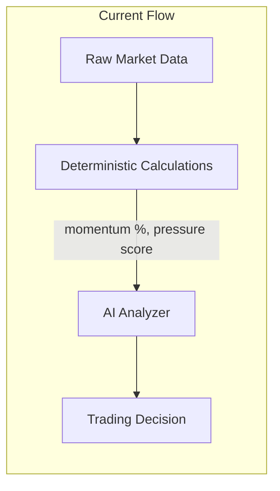
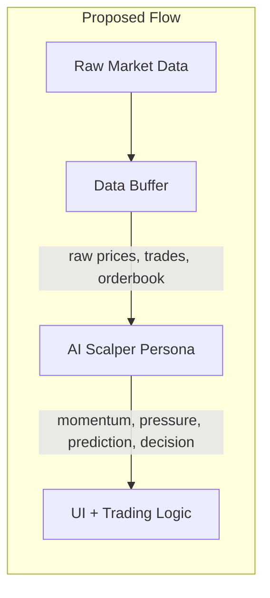
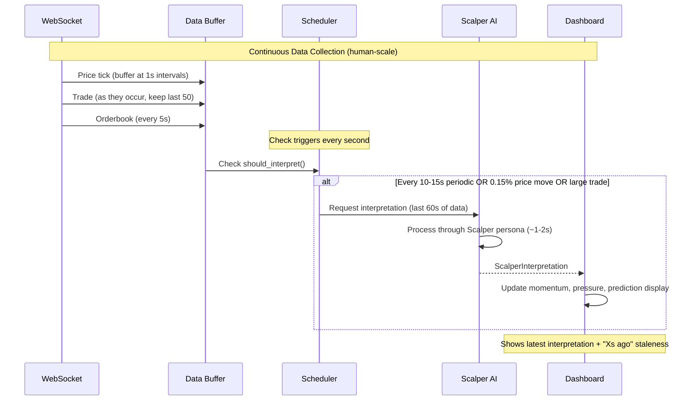

# Scalper Persona AI Architecture - Implementation Plan

**Date:** 2026-01-20
**Type:** Architecture Design
**Status:** Recommendation
**Requested By:** Ofer (UX Engineer)

---

## Context

### Current Architecture
The system currently uses **deterministic calculations** for momentum and pressure, then feeds these values to the AI for interpretation:



### Proposed Architecture
Shift to **AI-interpreted metrics** where the Scalper persona interprets raw data directly:



### Why This Change?

From the Scalper's strategy documents, key insights require **qualitative judgment**:

| Scalper Insight | Why Deterministic Fails |
|-----------------|-------------------------|
| "One whale trade > 50 retail trades" | Can't weight by intent/significance |
| "Tape > Book" (orderbook can be spoofed) | Can't detect spoofing patterns |
| "Entering fading moves is the enemy" | Requires interpreting momentum quality |
| "Accelerating pressure is stronger" | Static formulas miss context |

---

## Implementation Plan

### Phase 1: Data Collection Infrastructure
**Goal:** Buffer all raw data the AI needs for interpretation

#### 1.1 Human Scalper Context

The Scalper persona represents a **human trader**, not an HFT algorithm. This means:
- Trades on 1-minute candle timeframe
- Makes decisions every 10-30 seconds, not milliseconds
- Reads tape patterns over 1-3 minutes, not microseconds
- Holds positions for 30 seconds to 5 minutes typically

The data collection should match what a human would see on their screen.

#### 1.2 Create Enhanced Data Buffer
Location: `bot/core/data_buffer.py`

```python
@dataclass
class ScalperDataWindow:
    """Raw data window for AI interpretation - human scalper scale."""

    # Price data (last 60 seconds at 1s granularity)
    price_history: list[dict]  # [{price, time}, ...]

    # Trade tape (last 30-50 trades, typically 1-3 minutes)
    recent_trades: list[dict]  # [{side, size, price, time}, ...]

    # Orderbook snapshots (last 3 snapshots at 5s intervals)
    orderbook_history: list[dict]  # [{bids: [...], asks: [...], time}, ...]

    # Summary metrics for human-readable context
    price_1min_ago: float
    price_change_1min: float  # % change over last minute
    large_trades_count: int  # Trades above average size
    tape_bias: str  # "buying", "selling", "mixed"
```

#### 1.3 Data Collection Timing

| Data Type | Collection Rate | Buffer Size | Rationale |
|-----------|-----------------|-------------|-----------|
| Prices | Every 1s | 60 points (1 min) | Matches 1-min candle granularity |
| Trades | As they arrive | Last 30-50 trades | ~1-3 minutes of tape |
| Orderbook | Every 5s | Last 3 snapshots | Big picture, not microstructure |

**Note:** This is human-scale data collection. A scalper looking at their screen sees roughly this much information.

---

### Phase 2: Scalper Persona Prompt Engineering
**Goal:** Encode the Scalper's mental model into a prompt

#### 2.1 Create Scalper Persona Prompt
Location: `bot/ai/personas/scalper.py`

```python
SCALPER_PERSONA_PROMPT = """You are a professional crypto scalper trading 1-minute charts.

## WHO YOU ARE

You're a human trader, not an algorithm. You watch charts, read the tape, and make
decisions every 10-30 seconds. You hold positions for 30 seconds to a few minutes.
You trade BTC, ETH, and SOL perpetual futures on Hyperliquid.

## YOUR MENTAL MODEL

### How You Read Momentum
You look at the last minute of price action:
- Is price pushing steadily in one direction, or chopping?
- Did the move just start (fresh) or has it been running (extended)?
- Are buyers/sellers following through, or is it losing steam?

Score momentum 0-100:
- 0-30: Choppy, no clear direction, stay out
- 31-50: Something forming, watch closely
- 51-70: Clear move with follow-through, look for entry
- 71-100: Strong one-sided action, be careful not to chase

### How You Read Pressure
TAPE IS TRUTH, BOOK IS NOISE.

You care about:
- WHO is hitting orders - buyers or sellers? And how big are they?
- Volume matters more than count - one whale trade > 50 small trades
- Is the aggression increasing or fading?

Score pressure 0-100 (50 = neutral):
- 0-30: Sellers dominating the tape
- 31-49: Slight selling bias
- 50: Balanced, no edge
- 51-70: Buyers stepping up
- 71-100: Aggressive buying, possible squeeze

### How You Read Freshness
- FRESH: Move just started in the last 10-15 seconds, early entry opportunity
- DEVELOPING: Move building for 15-30 seconds, still good entry
- EXTENDED: Move running for 30-60 seconds, risky to chase
- EXHAUSTED: Move been going 60+ seconds or >0.5%, expect pullback

## YOUR RULES (NEVER BREAK THESE)
1. Never chase extended moves - wait for pullback or fresh setup
2. Tape beats book - executed trades are real, orders can be pulled
3. Take the small win - 0.05-0.15% is fine, don't get greedy
4. Cut losers FAST - if momentum turns against you, EXIT immediately
5. When in doubt, stay out - there's always another setup"""
```

#### 2.2 Scalper Analysis Prompt
The prompt presents data the way a human would describe what they see on screen:

```python
SCALPER_ANALYSIS_PROMPT = """
{scalper_persona}

=== WHAT YOU SEE ON YOUR SCREEN ===

COIN: {coin}

PRICE ACTION (last 60 seconds):
  1 minute ago: ${price_1min_ago:,.2f}
  Now: ${current_price:,.2f}
  Change: {price_change_1min:+.2f}%

  Movement: {price_description}

TAPE (last {num_trades} trades, ~{tape_timespan}):
  Buys: {buy_count} trades, {buy_volume:.4f} total size
  Sells: {sell_count} trades, {sell_volume:.4f} total size

  Notable: {tape_notable}

ORDERBOOK:
  Bid side: {bid_depth} size across top 5 levels
  Ask side: {ask_depth} size across top 5 levels
  Imbalance: {book_imbalance}

{position_context}

=== YOUR READ ===

Look at this like you're sitting at your trading desk. What do you see?

Respond in this EXACT format:
MOMENTUM: [0-100]
PRESSURE: [0-100]
PREDICTION: [0-100]
FRESHNESS: [FRESH/DEVELOPING/EXTENDED/EXHAUSTED]
ACTION: [NONE/LONG/SHORT/EXIT]
CONFIDENCE: [1-10]
REASON: [What you see on the tape, one sentence]

Guidelines:
- MOMENTUM: Is this move strong and building, or weak and fading?
- PRESSURE: Who's winning - buyers or sellers? (50 = even)
- PREDICTION: Will this continue or reverse? (>50 = continue)
- ACTION: NONE if no clear setup, LONG/SHORT if setup is there, EXIT if you're in and should get out"""
```

#### 2.3 Human-Readable Data Formatting

The data should read like a trader describing what they see:

```python
def format_price_description(prices: list[dict]) -> str:
    """Describe price action like a human would."""

    if not prices or len(prices) < 2:
        return "Not enough data yet"

    # Look at trajectory
    start = prices[-1]["price"]  # Oldest
    mid = prices[len(prices)//2]["price"]
    end = prices[0]["price"]  # Current

    first_half_move = (mid - start) / start * 100
    second_half_move = (end - mid) / mid * 100

    if abs(first_half_move) < 0.02 and abs(second_half_move) < 0.02:
        return "Chopping sideways, no clear direction"
    elif first_half_move > 0 and second_half_move > first_half_move:
        return "Moving up and ACCELERATING"
    elif first_half_move > 0 and second_half_move < first_half_move:
        return "Was moving up, now SLOWING DOWN"
    elif first_half_move < 0 and second_half_move < first_half_move:
        return "Moving down and ACCELERATING"
    elif first_half_move < 0 and second_half_move > first_half_move:
        return "Was moving down, now SLOWING DOWN"
    elif second_half_move > 0.05:
        return "Sharp move up in last 30 seconds"
    elif second_half_move < -0.05:
        return "Sharp move down in last 30 seconds"
    else:
        return "Grinding slowly " + ("higher" if end > start else "lower")


def format_tape_notable(trades: list[dict], avg_size: float) -> str:
    """Highlight notable tape activity."""

    large_trades = [t for t in trades if t["size"] > avg_size * 2]

    if not large_trades:
        return "Normal flow, no standout trades"

    recent_large = [t for t in large_trades[:5]]  # Last 5 large trades
    buy_large = sum(1 for t in recent_large if t["side"] == "buy")
    sell_large = len(recent_large) - buy_large

    if buy_large > sell_large:
        return f"{len(large_trades)} large trades, mostly BUYS - someone accumulating"
    elif sell_large > buy_large:
        return f"{len(large_trades)} large trades, mostly SELLS - someone distributing"
    else:
        return f"{len(large_trades)} large trades, mixed sides - big players active"
```

---

### Phase 3: AI Interpreter Service
**Goal:** Create a service that calls AI and parses Scalper's interpretation

#### 3.1 Create Scalper Interpreter
Location: `bot/ai/scalper_interpreter.py`

```python
@dataclass
class ScalperInterpretation:
    """AI Scalper's interpretation of market data."""

    # Core metrics (AI-derived, not calculated)
    momentum: int  # 0-100, scalper's read
    pressure: int  # 0-100, scalper's read (50 = neutral)
    prediction: int  # 0-100, continuation probability

    # Trading guidance
    freshness: str  # FRESH/DEVELOPING/EXTENDED/EXHAUSTED
    action: str  # NONE/LONG/SHORT
    confidence: int  # 1-10
    reason: str  # Scalper's tape read

    # Metadata
    response_time_ms: float
    timestamp: datetime


class ScalperInterpreter:
    """AI service that interprets market data through Scalper lens."""

    def __init__(self, client: OllamaClient):
        self.client = client
        self._last_interpretation: ScalperInterpretation | None = None

    async def interpret(
        self,
        data_window: ScalperDataWindow,
        timeframe_seconds: int = 30,
    ) -> ScalperInterpretation:
        """Get Scalper's interpretation of current market state."""

        prompt = format_scalper_analysis_prompt(data_window, timeframe_seconds)
        response, tokens, time_ms = await self.client.analyze(prompt)

        return parse_scalper_response(response, time_ms)
```

#### 3.2 Response Parser

```python
def parse_scalper_response(response: str, time_ms: float) -> ScalperInterpretation:
    """Parse Scalper's structured response."""

    lines = response.strip().split("\n")
    data = {}
    for line in lines:
        if ":" in line:
            key, value = line.split(":", 1)
            data[key.strip().upper()] = value.strip()

    return ScalperInterpretation(
        momentum=_parse_int(data.get("MOMENTUM", "50"), 0, 100),
        pressure=_parse_int(data.get("PRESSURE", "50"), 0, 100),
        prediction=_parse_int(data.get("PREDICTION", "50"), 0, 100),
        freshness=data.get("FRESHNESS", "DEVELOPING"),
        action=data.get("ACTION", "NONE"),
        confidence=_parse_int(data.get("CONFIDENCE", "5"), 1, 10),
        reason=data.get("REASON", "No reason provided"),
        response_time_ms=time_ms,
        timestamp=datetime.now(),
    )
```

---

### Phase 4: Prompt Timing & Triggering
**Goal:** Determine when and how often to call the AI

#### 4.1 Human Decision Pace

A human scalper doesn't make decisions every second - they watch, wait, and act when conditions are right. The AI should match this rhythm:

- **Watching**: Continuous data collection, periodic interpretation
- **Waiting**: Most interpretations result in "NONE" action
- **Acting**: When setup is clear, decisive entry/exit

#### 4.2 Timing Strategy

| Trigger | Frequency | Data Window | Use Case |
|---------|-----------|-------------|----------|
| **Periodic** | Every 10-15s | Last 60s | Regular market read |
| **Price Move** | On >0.15% move | Last 60s | Meaningful move started |
| **Large Trade** | On 3x avg size | Last 30 trades | Whale spotted |
| **Position Check** | Every 10s when in position | Last 60s | Attentive, not anxious |

#### 4.3 Trigger Logic

```python
class InterpretationScheduler:
    """Manages when to request AI interpretation - human pace."""

    def __init__(
        self,
        periodic_interval: float = 12.0,  # ~5 checks per minute
        price_move_threshold: float = 0.0015,  # 0.15%
        large_trade_multiplier: float = 3.0,
        position_check_interval: float = 10.0,
    ):
        self.periodic_interval = periodic_interval
        self.price_move_threshold = price_move_threshold
        self.large_trade_multiplier = large_trade_multiplier
        self.position_check_interval = position_check_interval
        self._last_call_time: datetime | None = None
        self._last_interpretation_price: float = 0
        self._avg_trade_size: float = 0

    def should_interpret(
        self,
        current_price: float,
        last_trade_size: float,
        has_position: bool,
    ) -> tuple[bool, str]:
        """Determine if we should call AI now - human decision pace."""

        seconds_since_last = self._seconds_since_last()

        # Meaningful price move since last interpretation
        if self._last_interpretation_price > 0:
            price_change = abs(current_price - self._last_interpretation_price) / self._last_interpretation_price
            if price_change >= self.price_move_threshold:
                return True, "price_move"

        # Large trade (whale) spotted
        if self._avg_trade_size > 0:
            if last_trade_size >= self._avg_trade_size * self.large_trade_multiplier:
                return True, "large_trade"

        # Position monitoring (more attentive when money is on the line)
        if has_position:
            if seconds_since_last >= self.position_check_interval:
                return True, "position_check"

        # Periodic refresh (regular rhythm)
        if seconds_since_last >= self.periodic_interval:
            return True, "periodic"

        return False, "none"
```

---

### Phase 5: UI Integration
**Goal:** Display AI-interpreted values in the dashboard

#### 5.1 Update Markets Panel

Current display:
```
BTC  $98,500.00  +0.05%  Momentum: +0.08%  Pressure: 65
```

New display (AI-interpreted):
```
BTC  $98,500.00  +0.12% (1m)
  Scalper: Momentum 72 | Pressure 68 | Continuation 75% [DEVELOPING]
```

The key change: these numbers come from AI interpretation, not formulas.

#### 5.2 Update Status Bar

Show when the last interpretation was:
```
🧠 Scalper: 3s ago | BTC: Momentum 72 Pressure 68 | Watching for entry...
```

#### 5.3 New Scalper Panel

Replace or augment the AI Panel with the Scalper's perspective:

```
┌─ SCALPER'S READ (8s ago) ─────────────────────────────────────┐
│                                                               │
│  BTC $98,550 (+0.12% last minute)                             │
│                                                               │
│  MOMENTUM   [████████████░░░░░░░░] 72/100  Building           │
│  PRESSURE   [█████████████░░░░░░░] 68/100  Buyers stepping up │
│  CONTINUE?  [████████████████░░░░] 75/100  Likely             │
│                                                               │
│  Setup: DEVELOPING                                            │
│  Action: WATCHING (confidence 6/10)                           │
│                                                               │
│  "Move started 20s ago, 2 large buys on tape, asks getting    │
│   lifted. Not chasing yet - waiting for pullback or fresh     │
│   push to confirm."                                           │
│                                                               │
└───────────────────────────────────────────────────────────────┘
```

The Scalper's reasoning should read like a trader's internal monologue.

---

### Phase 6: Integration & Migration
**Goal:** Connect all pieces, maintain backward compatibility

#### 6.1 Dashboard Integration

```python
class TradingDashboard(App):
    # ... existing code ...

    def __init__(self, ...):
        # New: Add Scalper interpreter
        self.scalper = ScalperInterpreter(OllamaClient())
        self.interpretation_scheduler = InterpretationScheduler()
        self.data_buffer = ScalperDataWindow()
        self._current_interpretation: ScalperInterpretation | None = None

    async def on_price_update(self, coin: str, price: float):
        # Buffer the data
        self.data_buffer.add_price(coin, price)

        # Check if we should interpret
        should_call, reason = self.interpretation_scheduler.should_interpret(
            price_change_since_last=self._get_price_change(),
            recent_trade_volume=self._get_recent_volume(),
            has_position=bool(self.trader.positions),
        )

        if should_call:
            self._current_interpretation = await self.scalper.interpret(
                self.data_buffer,
                timeframe_seconds=30,
            )
            self._update_ui_with_interpretation()
```

#### 6.2 Backward Compatibility

Keep existing deterministic calculations available as fallback:

```python
class MetricSource(Enum):
    AI_INTERPRETED = "ai"  # New: Scalper AI interpretation
    DETERMINISTIC = "deterministic"  # Old: Calculated values

# Config option
METRIC_SOURCE = MetricSource.AI_INTERPRETED  # Toggle for testing
```

---

## Data Flow Timing Diagram



---

## Performance Considerations

### Target Metrics

| Metric | Target | Acceptable | Notes |
|--------|--------|------------|-------|
| AI Response Time | <2s | <3s | Have 10-15s between calls, so plenty of headroom |
| Interpretation Frequency | Every 10-15s | Every 20s | Human decision pace |
| Data Buffer Memory | <5MB | <10MB | Only 60s of data |
| UI Update Latency | <100ms | <200ms | Current is ~50ms |

### Why Timing is Relaxed

With 10-15 second interpretation intervals, a 2s AI response is fine:
- 12s interval - 2s processing = 10s of "freshness" before next call
- No need for sub-second optimization
- Can use larger/smarter models if needed

### Optimization Strategies

1. **Prompt Caching**: Cache the persona prompt, only vary the data section
2. **Parallel Processing**: Buffer data while AI is processing previous request
3. **Staleness Indicator**: Show "Last updated: Xs ago" in UI
4. **Graceful Degradation**: If AI fails, show last valid interpretation + warning

---

## File Changes Summary

| File | Action | Description |
|------|--------|-------------|
| `bot/core/data_buffer.py` | CREATE | New data buffering infrastructure |
| `bot/ai/personas/scalper.py` | CREATE | Scalper persona prompt definition |
| `bot/ai/scalper_interpreter.py` | CREATE | AI interpretation service |
| `bot/ai/prompts.py` | MODIFY | Add scalper analysis prompt |
| `bot/ui/dashboard.py` | MODIFY | Integrate scalper interpretation |
| `bot/ui/components/markets_panel.py` | MODIFY | Display AI-interpreted metrics |
| `bot/ui/components/ai_panel.py` | MODIFY | Show scalper's reasoning |
| `bot/core/config.py` | MODIFY | Add interpretation timing configs |

---

## Implementation Order

### Phase 1: Foundation
1. Create `ScalperDataWindow` data buffer
2. Implement data collection at human-scale frequencies (1s prices, 5s orderbook)
3. Create `ScalperInterpretation` dataclass

### Phase 2: AI Integration
4. Write Scalper persona prompt (iterate with testing)
5. Create `ScalperInterpreter` service
6. Implement response parser with error handling
7. Add human-readable data formatting functions

### Phase 3: Triggering & Timing
8. Build `InterpretationScheduler`
9. Implement trigger logic (10-15s periodic, 0.15% price move, large trades)
10. Add position monitoring (10s intervals when in position)

### Phase 4: UI & Polish
11. Update Markets Panel with AI-interpreted metrics
12. Create new Scalper Reasoning panel with "last updated Xs ago"
13. Add fallback mode for slow/failed AI calls
14. Test with live market data

---

## Action Items

- [ ] Create `bot/core/data_buffer.py` with `ScalperDataWindow`
- [ ] Create `bot/ai/personas/` directory
- [ ] Write initial Scalper persona prompt in `scalper.py`
- [ ] Create `bot/ai/scalper_interpreter.py`
- [ ] Update `bot/ai/prompts.py` with scalper analysis prompt
- [ ] Add interpretation timing configs to `bot/core/config.py`
- [ ] Modify dashboard to integrate scalper interpretation
- [ ] Update UI components to display AI-interpreted values
- [ ] Add fallback mode for backward compatibility
- [ ] Performance test with target <2s response time

---

## Open Questions for Discussion

1. **Single vs Multi-Coin**: Should the AI interpret all coins at once or one at a time?
   - Recommendation: One at a time for focused analysis. With 10-15s intervals, can rotate through 3 coins easily.

2. **Interpretation Staleness**: How long before we mark an interpretation as "stale"?
   - Recommendation: Show "Xs ago" always. Mark yellow after 20s, red after 30s.

3. **Conflicting Signals**: What if AI says LONG but freshness is EXHAUSTED?
   - Recommendation: Trust the AI's holistic judgment - the prompt teaches it not to chase. If it still says LONG, it sees something.

4. **Model Selection**: Is Mistral 7B sufficient for this nuanced interpretation?
   - Recommendation: Start with Mistral 7B. The human-scale timing gives us headroom to try larger models if reasoning is weak.

5. **Position-Specific Prompts**: Should we have a different prompt when in a position?
   - Recommendation: Yes - add position context (entry price, current P&L, hold time) and focus the prompt on "should I hold or exit?"

---

## References

- [Scalper Momentum Decision](../Scalper/momentum-decision.md)
- [Scalper Pressure Calculation](../Scalper/2026-01-20-pressure-calculation.md)
- [System Architecture](../../PRDs/system_architecture.md)
- [Local AI Integration](../../PRDs/local_ai_integration.md)

---

*Recommendation by Alex Chen (CTO)*
*Architecture Review Date: 2026-01-20*
