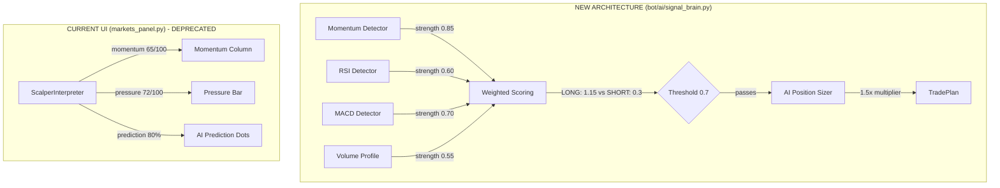

# Live UI Redesign for Signal-Based Architecture

**Date:** 2026-01-29
**Persona:** Maya Torres (Lead Product Designer)
**Type:** Design Consultation & Architecture Review

---

## Executive Summary

The current live trading UI (`bot/ui/dashboard.py`) is architecturally misaligned with the new signal-based trading system. The UI displays data from the deprecated `ScalperInterpreter` system while the actual trading logic now uses the 3-layer `SignalBrain` architecture. This report outlines recommended changes to align the UI with the current architecture and improve user understanding of AI behavior.

---

## Problem Statement

### Architecture Mismatch



### Key Issues

| UI Element | Currently Shows | Should Show |
|------------|-----------------|-------------|
| MOMENTUM column | ScalperInterpreter's 0-100 value | Signal detector outputs (MOMENTUM, RSI, etc.) |
| PRESSURE bar | ScalperInterpreter's 0-100 value | Real orderbook data (this is valid) |
| AI PREDICTION | Scalper freshness + prediction dots | Signal scores, threshold, AI sizing decision |
| Goal tracking | **Missing entirely** | Goal progress, pace status, AI multiplier |
| Charts panel | Candlestick charts | **Remove** - not needed for AI-driven system |

### Deprecated Code in `dashboard.py`

The following components use the old architecture and should be replaced:

1. `ScalperInterpreter` - Old AI persona (0-100 outputs)
2. `run_scalper_interpretation()` - Calls old AI system
3. `_display_scalper_interpretation()` - Formats old AI output
4. `interpretation_scheduler` - Schedules old system calls
5. `_scalper_interpretations` cache - Stores old format data

---

## Recommended Changes

### 1. Add Goal Progress Panel (P0 - Critical)

The `AccountContext` contains goal data that drives AI position sizing, but this is completely invisible to the user.

**Proposed Component:** `GoalPanel`

```
┌─────────────────────────────────────────────────────────────────────────────┐
│ 🎯 $10,000 → $15,000 (30 days)                          Day 16 of 30        │
│ ═══════════════════════════│═══════════════════════════════════════════════ │
│ ████████████████░░░░░░░░░░░│░░░░░░░░░░░░░░░░░░░░░░░░░░░░░░░░░░░░░░░░░░░░░░ │
│ Progress: 42% ($2,100)      │  Time: 53%              Status: BEHIND 🔶     │
│ Required: +1.82%/day        AI Multiplier: 1.5x (aggressive)                │
└─────────────────────────────────────────────────────────────────────────────┘
```

**Data Source:** `AccountContext` from `bot/ai/models.py`

**Key Properties to Display:**
- `account_goal` - Target balance
- `goal_progress_pct` - Progress toward goal
- `time_progress_pct` - Time elapsed
- `pace_status` - "ahead", "on_pace", "behind", "goal_reached"
- `required_daily_return_pct` - Daily return needed
- AI position multiplier from last decision

**Visual Design:**
- Progress bar with time marker overlay
- Green fill when ahead/on_pace, orange when behind
- White vertical line at time position
- Color-coded status indicator

**Rationale:** The AI uses goal context to decide position sizing (0.5x-2.0x multiplier). Users need to see this to understand why AI is being conservative or aggressive.

---

### 2. Replace Scalper Data with Signal Detector Outputs (P0 - Critical)

**Current:** Shows `scalper_momentum`, `scalper_pressure`, `scalper_prediction` (0-100 scale)

**Proposed:** Show actual signal detector outputs

**New Trade Desk Columns:**

| Column | Content | Width |
|--------|---------|-------|
| COIN | Symbol + tick direction | 8 |
| PRICE | Current price | 12 |
| SIGNALS | Detector outputs (MOM▲0.85 RSI▲0.60 etc.) | 28 |
| SCORE | LONG/SHORT weighted scores + threshold | 20 |
| POSITION | Current position + P&L | 24 |

**Signal Display Format:**
```
MOM▲0.85 RSI▲0.60 MACD─ VP▲0.55
```
- `▲` Green = LONG signal
- `▼` Red = SHORT signal
- `─` Gray = No signal / filtered out
- Number = signal strength (0.0-1.0)

**Score Display Format:**
```
L:1.15 ████████░░ 0.7
S:0.40 ████░░░░░░
```
- Bar fills proportionally to score
- White marker at threshold position
- Shows at-a-glance: "Is this signal strong enough?"

---

### 3. Remove Charts Panel (P1 - High)

**Rationale:**
- User doesn't make trading decisions - AI does
- Charts are for human visual pattern recognition, but AI uses signal detectors
- Charts consume ~30% of screen real estate
- The SIGNALS column shows exactly what the AI "sees"
- Removing charts frees space for more relevant information

**Alternative:** Make charts toggle-able with `[C]` keybinding for users who want them occasionally.

---

### 4. Update AI Panel Log Format (P1 - High)

**Current Format (Scalper-based):**
```
[12:34:56] ━━━ 🤖 AI DECISION (Momentum Scalper) ━━━
           Momentum: BTC 65/100
           Pressure: 72/100 (Buying)
           Action: LONG | Confidence: 8/10
           "Strong buying pressure with momentum"
```

**Proposed Format (SignalBrain-based):**
```
[12:34:56] ━━━ 🤖 AI SIZING DECISION ━━━
           Direction: LONG BTC (from signals)
           Signal Score: 1.15 (threshold: 0.7) ✓

           🎯 GOAL CONTEXT:
           Progress: 42% │ Time: 53% │ Status: BEHIND

           POSITION SIZING:
           Multiplier: 1.5x (aggressive)
           Base: 10% → Actual: 15%

           Reason: "Strong setup, behind on goal,
                    increasing size to catch up"

           ⚡ 145ms
```

**Key Changes:**
- Shows that direction comes from signals, not AI
- Displays weighted score vs threshold
- Shows goal context that influenced sizing
- Shows position multiplier and final size
- Makes clear AI decides SIZE, not DIRECTION

---

### 5. Add Dedicated Positions Panel (P2 - Medium)

With charts removed, create a dedicated section for position details:

```
┌──────────────────────────────────────────────────────────────┐
│ 📋 POSITIONS                                                  │
├──────────────────────────────────────────────────────────────┤
│ BTC   LONG 0.0015  Entry: $101,200  Current: $102,450        │
│       P&L: +$187 (+1.85%)  SL: $99,800  TP: $104,500         │
│                                                               │
│ SOL   SHORT 2.5    Entry: $145.30   Current: $142.80         │
│       P&L: -$12 (-0.83%)   SL: $148.00  TP: $138.00          │
└──────────────────────────────────────────────────────────────┘
```

Shows more detail than current cramped table column:
- Entry price
- Stop loss and take profit levels
- Clear P&L with both $ and %

---

## Proposed Layout (Complete)

```
┌─────────────────────────────────────────────────────────────────────────────────────────────────┐
│ PAPER TRADING SIMULATOR  ⟫  session_name                                                        │
├─────────────────────────────────────────────────────────────────────────────────────────────────┤
│ 🎯 $10K → $15K (30d) │ ████████░░░░│░░░░░░░░ 42%/53% │ BEHIND 🔶 │ +1.8%/day │ 🤖 1.5x         │
├─────────────────────────────────────────────────────────────────────────────────────────────────┤
│ 🟢 live │ ⏱️ 00:16:42 │ 💰$12,100 │ 📈$12,350 │ P&L: +$2,100 (+21%) │ 📊8 trades │ Momentum    │
├─────────────────────────────────────────────────────────────────────────────────────────────────┤
│                                                                                                 │
│  ┌─────────────────────────────────────────┐  ┌─────────────────────────────────────────────┐  │
│  │ 🤖 AI REASONING                         │  │ 📊 TRADE DESK                                │  │
│  │                                         │  │                                              │  │
│  │ [12:34:56] ━━━ AI SIZING DECISION ━━━   │  │ COIN   PRICE      SIGNALS              SCORE│  │
│  │ Direction: LONG BTC (from signals)      │  │ ────── ────────── ────────────────── ───────│  │
│  │ Score: 1.15 (threshold: 0.7) ✓          │  │ BTC ▲  $102,450   MOM▲0.85 RSI▲0.60  L:1.15 │  │
│  │                                         │  │                   MACD─    VP▲0.55   S:0.40 │  │
│  │ 🎯 GOAL: BEHIND (42% vs 53%)            │  │                                              │  │
│  │                                         │  │ ETH ─  $3,245     MOM▲0.50 RSI─      L:0.50 │  │
│  │ SIZING: 1.5x aggressive                 │  │                   MACD─    VP▲0.40   S:0.20 │  │
│  │ Base: 10% → Actual: 15%                 │  │                                              │  │
│  │ "Strong setup, behind goal"             │  │ SOL ▼  $142.80    MOM▼0.70 RSI▼0.55  L:0.25 │  │
│  │                                         │  │                   MACD▼0.60 VP─      S:0.95 │  │
│  │ ⚡ 145ms                                │  │                                              │  │
│  │                                         │  ├──────────────────────────────────────────────│  │
│  │ [12:34:46] Signal threshold met         │  │ 📋 POSITIONS                                 │  │
│  │ for BTC LONG (1.15 >= 0.7)              │  │                                              │  │
│  │                                         │  │ BTC  LONG 0.0015  @ $101,200  +$187 (+1.8%) │  │
│  │ [12:33:21] Price update: BTC $102,450   │  │ SOL  SHORT 2.5    @ $145.30   -$12 (-0.8%)  │  │
│  │                                         │  │                                              │  │
│  │ [12:32:15] ━━━ TRADE EXECUTED ━━━       │  ├──────────────────────────────────────────────│  │
│  │ LONG BTC 0.0015 @ $101,200              │  │ 📜 TRADE HISTORY                             │  │
│  │ Stop: $99,800 │ TP: $104,500            │  │                                              │  │
│  │                                         │  │ 12:30 BTC LONG  → +$245 (+2.4%) TP hit      │  │
│  │ [12:31:50] Signals detected: MOM, RSI   │  │ 12:15 ETH SHORT → -$82 (-1.1%) SL hit       │  │
│  └─────────────────────────────────────────┘  └─────────────────────────────────────────────┘  │
│                                                                                                 │
├─────────────────────────────────────────────────────────────────────────────────────────────────┤
│ [Q]uit  [R]eset  [P]ause  [S]trategy  [T]uning Report                                          │
└─────────────────────────────────────────────────────────────────────────────────────────────────┘
```

---

## Implementation Plan

### Priority Matrix

| Priority | Change | Effort | Impact | Files Affected |
|----------|--------|--------|--------|----------------|
| **P0** | Add Goal Progress Panel | Medium | Critical | New: `goal_panel.py`, Modify: `dashboard.py` |
| **P0** | Replace Scalper with SignalBrain | High | Critical | `dashboard.py`, `markets_panel.py` |
| **P0** | Update SIGNALS column | Medium | High | `markets_panel.py` |
| **P1** | Remove Charts Panel | Low | Medium | `dashboard.py` (remove from layout) |
| **P1** | Update AI Panel log format | Low | Medium | `ai_panel.py`, `dashboard.py` |
| **P2** | Add Positions Panel | Medium | Medium | New: `positions_panel.py` |
| **P2** | Status bar goal summary | Low | Low | `status_bar.py` |

### Files to Create

| File | Purpose |
|------|---------|
| `bot/ui/components/goal_panel.py` | Goal tracking display |
| `bot/ui/components/positions_panel.py` | Dedicated positions view |

### Files to Modify

| File | Changes |
|------|---------|
| `bot/ui/dashboard.py` | Remove ScalperInterpreter, integrate SignalBrain, add GoalPanel, remove ChartsPanel from layout |
| `bot/ui/components/markets_panel.py` | Replace scalper data with signal detector outputs, add weighted score display |
| `bot/ui/components/ai_panel.py` | Update log format for sizing decisions |
| `bot/ui/components/status_bar.py` | Add compact goal summary |
| `bot/ui/components/__init__.py` | Export new components |

### Files to Deprecate

| File | Status |
|------|--------|
| `bot/ui/components/charts_panel.py` | Keep file but remove from default layout |
| `bot/ai/scalper_interpreter.py` | Mark as legacy, remove usage from dashboard |
| `bot/ai/interpretation_scheduler.py` | Mark as legacy, remove usage from dashboard |

---

## Design Specifications

### Color Palette

| Element | Color | Hex |
|---------|-------|-----|
| Positive/LONG/Profit | Green | `#44ffaa` |
| Negative/SHORT/Loss | Red | `#ff7777` |
| Warning/Behind | Orange | `#ffaa44` |
| Neutral/On Pace | Yellow | `#ffff44` |
| Accent/Highlight | Cyan | `#00d7ff` |
| Dim/Inactive | Gray | `#666666` |
| Background | Dark | `#0a0a0a` |
| Panel Border | Border Gray | `#333333` |

### Pace Status Colors

| Status | Color | Icon |
|--------|-------|------|
| `goal_reached` | Green (#44ffaa) | 🟢 |
| `ahead` | Green (#44ffaa) | 🟢 |
| `on_pace` | Yellow (#ffff44) | 🟡 |
| `behind` | Orange (#ffaa44) | 🔶 |
| `just_started` | Gray (#666666) | ⚪ |

### AI Multiplier Colors

| Range | Color | Label |
|-------|-------|-------|
| ≥1.5x | Orange | aggressive |
| 1.2x-1.5x | Yellow | elevated |
| 0.8x-1.2x | White | standard |
| ≤0.7x | Cyan | conservative |

---

## Key Design Principles Applied

1. **Show What the AI Sees** - Display signal detector outputs, not interpreted values
2. **Explain AI Behavior** - Goal context explains why AI is aggressive/conservative
3. **Remove Redundancy** - Charts are for manual traders; this is AI-driven
4. **Match Architecture** - UI components map directly to system components
5. **Glanceability** - Critical info (goal status, signals, P&L) visible at once

---

## Questions for CTO Review

1. **SignalBrain Integration** - Should the live dashboard call `SignalBrain.evaluate_signals()` directly, or should we create a lighter wrapper for real-time use?

2. **Historical Mode** - The current historical replay synthesizes trades for ScalperInterpreter. Should this be updated to feed signal detectors instead?

3. **Portfolio Mode** - The `PortfolioAllocator` exists in the architecture but isn't surfaced in UI. Should we add multi-asset allocation display?

4. **Strategy Switching** - Currently uses `action_cycle_strategy()`. With SignalBrain, should users be able to adjust `signal_weights` live, or just switch between predefined strategies?

---

## References

- `bot/ai/signal_brain.py` - New architecture core
- `bot/ai/models.py` - AccountContext, TradePlan models
- `bot/strategies/README.md` - Strategy definitions and weights
- `docs/trading-flow.md` - Data flow documentation
- `bot/ui/dashboard.py` - Current implementation (legacy patterns)

---

*Report generated by Maya Torres, Lead Product Designer*
*2026-01-29*
