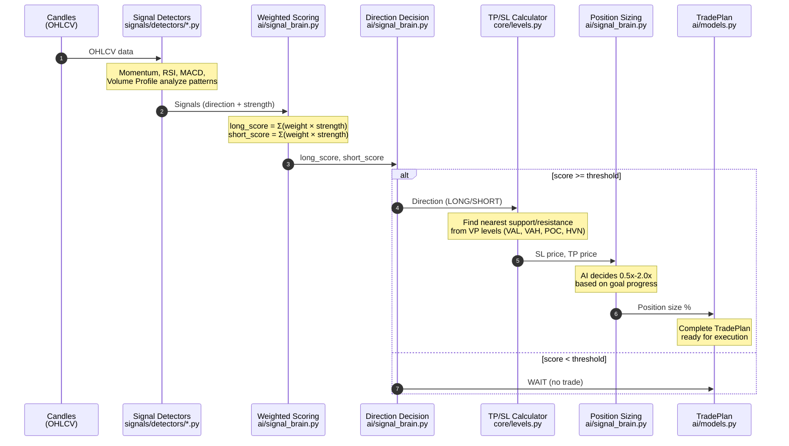

# Trading System Flow

This document explains how the trading system works, from signal detection to trade execution.

## Data Flow



## Step Details

### Step 1: Signal Detection

**Files:** `bot/signals/detectors/*.py`, `bot/signals/aggregator.py`

Each detector analyzes candles and outputs signals with direction (LONG/SHORT) and strength (0.0-1.0):

| Detector | Pattern | File |
|----------|---------|------|
| Momentum | EMA crossovers | `momentum.py` |
| RSI | Oversold/overbought + divergences | `rsi.py` |
| MACD | Histogram momentum | `macd.py` |
| Volume Profile | VAH/VAL breakouts, POC tests | `volume_profile.py`, `prev_day_vp.py` |

---

### Step 2: Weighted Scoring

**Files:** `bot/ai/signal_brain.py`, `bot/strategies/*.py`

Signals are weighted using strategy-defined weights:

```
long_score  = Σ (weight × strength) for LONG signals
short_score = Σ (weight × strength) for SHORT signals
```

**Example:** MOMENTUM LONG (0.85 × 1.0) + RSI LONG (0.75 × 0.3) = 1.075

---

### Step 3: Direction Decision

**Files:** `bot/ai/signal_brain.py`, `bot/strategies/base.py`

Direction is deterministic:

```
IF long_score >= threshold AND long_score > short_score → LONG
IF short_score >= threshold AND short_score > long_score → SHORT
ELSE → WAIT
```

---

### Step 4: Structure-Aware TP/SL

**Files:** `bot/core/levels.py`, `bot/indicators/volume_profile/`

TP/SL uses Volume Profile structure levels:

| Direction | Stop Loss | Take Profit |
|-----------|-----------|-------------|
| LONG | Below nearest support (VAL, POC, HVN) | At nearest resistance (VAH, POC, HVN) |
| SHORT | Above nearest resistance (VAH, POC, HVN) | At nearest support (VAL, POC, HVN) |

ATR used as sanity check to cap unreasonable distances.

---

### Step 5: Position Sizing

**Files:** `bot/ai/signal_brain.py`, `bot/ai/ollama_client.py`

AI decides position size multiplier (0.5x - 2.0x) based on:
- Goal progress (ahead/behind schedule)
- Signal strength and quality
- Market volatility

---

### Step 6: Output

**Files:** `bot/ai/models.py`, `bot/backtest/engine.py`

```python
TradePlan(
    action="LONG",
    coin="BTC",
    size_pct=22.5,
    stop_loss=99200,
    take_profit=102000,
    reason="Signal consensus: LONG | SL: Below VAL | TP: At VAH"
)
```

---

## Running Modes

| Mode | Command | Behavior |
|------|---------|----------|
| **Signals Only** | (no --ai flag) | Steps 1-4, no AI sizing |
| **AI Sizing** | `--ai` | Steps 1-5 with AI position sizing |
| **AI + Goals** | `--ai --goal X --goal-days Y` | AI sizes based on goal progress |
| **Portfolio** | `--ai --portfolio --goal X` | Multi-asset allocation |

## Key Insight

**The AI never decides direction.** Direction is deterministic from weighted scoring.
The AI only decides **how much** to risk on a trade that's already been decided.
